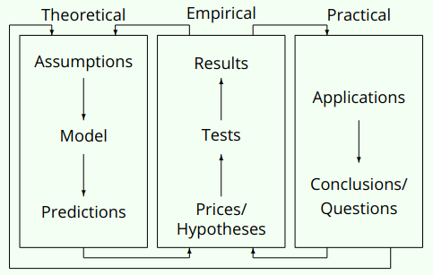
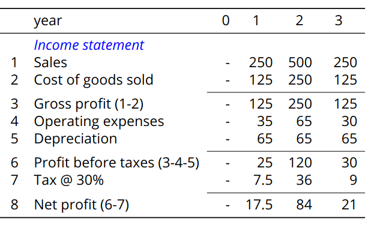
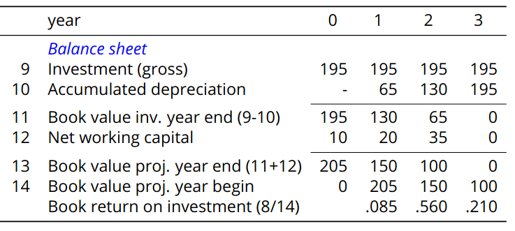

# Finance for Science and Technology Students
<!-- 
## Finance as science

- Shows how people choose between uncertain future values
- Studies economic problems for alternatives that involve time, money and uncertainty
- Went from descriptive to analytic and quentitative
- 2 angles of approach
  - Solving decision problems in practice (managerial finance)
  - Generate knowledge of general validity (theory of finance)
- Main tools of finance
  - Formulation of theories
  - Empirical testing through confrontation with real-life data
  - Application of results
- Interlocking cycles of scientific and applied results
  - 
- Finance as theoretical science
  - Takes actual, relevant problem
  - Make problem manageable by simplifying assumptions
    - Greedy investors, no transaction cost, etc.
  - Translate into mathematical terms
  - Use math to formulate predictions
    - Hypotheses
    - Prices
- Finance as empirical science
  - Tests financial theories
  - Confronts solutions with real-life data
    - Prices on financial stocks, bonds, derivatives, etc.
    - Accounting and other data
  - Empirical relations in finance are special
- Finance as an applied science
  - Use results of not rejected theories to:
    - Buy or sell on financial market
    - Accept or reject investment proposal
    - Choose capital structure for project or company
- Nature of financial economics
  - Makes relations less precise
    - Studies how people choose between uncertain future values
      - Largely unpredictable due to financial
    - On markets, accurate predictions self-destruct
      - Information allowing accurate prices immediately incorporated into pricing
      - Later price changes depend on new information
  - Market efficiency
    - Explains why important study objects like stock price should be unpredictable
  - Financial market functions properly if there is high unexplained variance

### Time value of money

- Free risk interest rate
  - 1 USD today is worth more than 1 USD tomorrow
  - "Price" of postponing/advancing consumption
  - Does not include compensation of risk
  - 2 reasons why?
    - Time preferences (human inpacience)
      - Prefer present to future consumption
    - Productive investment opportunities
      - Increase consumption later by giving up consumption now
- Consequence
  - Amounts cannot be compared in different points in time
  - Amounts have to be moved through time to same point, adjusting for time value
    - *Compounding* if moved forward in time
    - *Discounting* if moved backward in time
  - Interest is compounded when
    - Added to principal sum
    - Starts earning interest
    - Formula interest: $FV_T = PV(1+r)^T$
      - $FV$: future value
      - $PV$: present value
      - $r$: interest rate
  - Same principle applies to discounting
    - Now we want to find $PV$
    - Formula: $PV = \frac{FV_T}{(1+r)^T}$
  - Compounding periods are not necessarily the same as interest periods
    - Corporate bonds often pay interest 2 times per year even though interest rate is annual
    - Effective annual rate for 10\% annual rate becomes $1.05^2 = 1.1025$
    - Formula for future value with variable comopound frequency is $FV_T = PV(1+\frac{r}{n})^{T_n}$
    - If $n\to \infty$, the formula becomes $FV_T = PV[(1+\frac{r}{n})^\frac{n}{r}]^{rT}$
    - Remember $e = \lim_{c \to \infty} (1 + \frac{1}{c})^c \approx 2.71828\dots$
    - Formula becomes $FV_T = PV\cdot e^{rT}$
    - Normal to use logarithmic rates as follows: $\ln(\frac{FV_T}{PV}) = rT$
    - Advantageous if calculating daily stock prices
      - $\ln(\frac{FV_1}{PV_1}\cdot \frac{FV_2}{PV_2}) = \ln(\frac{FV_1}{PV_1}) + \ln(\frac{FV_2}{PV_2}) = r_1 + r_2$
      - Not additive accross investments
- Annuities and perpetuities
  - Cash flows often come in series
  - Annuity = yearly, perpetuity = forever
  - Use math to calculate value
  - Series of $n$ peyments of amount $A$: $PV = \frac{A}{1+r} + \frac{A}{(1+r)^2}+\dots+\dots+\frac{A}{(1+r)^n}$
  - Gordon growth model = present value of perpetuity
  - Formula: $PV = \frac{A}{r}$ (easily derived, apparently)
  - Formule for perpetuity witht growth $g$: $PV=\frac{A}{r-g}, r>g$
  - Often used due to simplicity

### Risk and valuation

- Valuation is important
- Defined as discounted value of expected future cash flow over time
- Formula: $Value = \sum^t\frac{Exp[Cashflow_t]}{(1+discount_t)^t}$
- Two major dimentions to value: time and risk
- Risk
  - Can be accounted for in different ways
    - Adjust discount rate
      - Use Capital Asset Pricing Model (CAPM) or
      - Use Ross' Arbitrage Pricing Theory (APT)
      - Formula becomes $Value = \sum^t\frac{Exp[Cashflow_t]}{(1+risk\space adjusted\space discount_t)^t}$
    - Adjust cash flow to certainty equivalent cash flows
      - Using CAPM or
      - Derivative securities such as futures
      - Formula becomes $Value = \sum^t\frac{CertaintyEquivalent[Cashflow_t]}{(1+risk\space adjusted\space discount_t)^t}$
    - Adjust probabilities from normal to risk-neutral or equivalent martingale probabilities
      - Black & Scholes or binomial option pricing
      - Formula becomes $Value = \sum^t\frac{Exp^P[Cashflow_t]}{(1+risk\space adjusted\space discount_t)^t}$

## Fundamental concepts and techniques

- Recall: two basic rules
  - $1 today si worth mroe than $1 tomorrow
  - Safe $1 is worth more than risky $1
- Time value of money
  - Risk-free rate
  - Discounting and compounding
  - Annuities and perpetuities

#### Investment analysis

- Accounting representation of a firm
  - Marked values used when possible
  - Book values used when necessary
    - Comes from accounting systems
      - Flow of goods/money through firms (what comes in and what goes out)
      - Effects of assets and liability equity (what the firm owns and where the money came from)
  - See slides for accounting (financial) statements
  - Book values can differ from market values
    - Values are frozen when entered into books
      - Long-lived assets can grow away over time
    - Some assets grow over time, not recorded in books
      - Result of R&D
      - Market position, trade marks
    - Accounting provides accountability
      - Looking back at what happened
      - Includes arbitrary allocations of cost and profit over time (deprecation)
      - Includes elemnts not relevant for decisions (irreversible investments or sunk cost)
- Discounting in investment analysis
  - Example: tech project ZXco
    - Technical and economic viability demonstrated in large test, cost €15 million
    - Now considering commercial launch
  - Cost of capital per project is 25%
    - Includes time value of money and expected inflation
    - Plus risk premium estimated from similar projects
    - Thus defined, it is *opportunity cost per capital*
  - Corporate tax rate is 30%
  - 
  - 
  - Does accounting representation give decision criterion on whether to accept project or not?
    - Book return < CoC in 2-3 years
    - Could use weighted averages
      - $\frac{205\cdot 0.85 + 150\cdot 0.56+100\cdot 0.21}{205+150+100} \approx 0.269 > CoC \implies$ accept?
    - Heavily influenced by deprecation
    - Ignores time and risk: later returns less valuable
  - Financial representation provides proper decision framework
    - Uses only data relevant for decision
    - Uses cash flow as they occur

--- -->

### **Finance for Science and Technology Students - Chapter 1: Introduction**

**Lecturers: Felipe Van de Sande Araujo, Anne Neumann, Carlos Miguel Dos Santos Oliveira**  
**Date: January 8, 2025**  

---

### **1. Course Overview**

- Introduces **finance** as a scientific discipline and a practical tool for financial decision-making.  
- Assumes **no prior knowledge** of finance but builds on students' **quantitative skills**.  
- Covers:  
  - **Time value of money**  
  - **Accounting concepts**  
  - **Microeconomics** (basic elements)  

---

### **2. Course Orientation**

- **Conceptual rather than technical**:
  - How should investment decisions be made?
  - What determines the cost of capital?
  - What is market efficiency?
  - How are options priced?
- Some **technical aspects** included for deeper understanding.  

---

### **3. Finance as a Science**

- Studies **how people allocate scarce resources** under **uncertainty**.  
- A social science, but closely related to natural sciences due to its **quantitative approach**.  
- Uses:  
  - **Mathematical models**  
  - **Empirical testing**  
  - **Application to real-world problems**  

#### **Key Approaches in Finance**

1. **Managerial Finance**  
   - Solves **practical** financial decision-making problems.  
   - "Approximate answer to a precise problem."  
2. **Financial Economics (Theory of Finance)**  
   - Develops **general knowledge** and principles.  
   - "Precise answer to an approximate problem."  

---

### **4. Nobel Prizes in Finance**

- Several economists awarded for their **pioneering work**:  
  - **Harry Markowitz, Merton Miller, William Sharpe (1990)** – Portfolio theory.  
  - **John Nash (1994)** – Game theory.  
  - **Robert Merton, Myron Scholes (1997)** – Derivative pricing models.  

---

### **5. Key Tools in Finance**

- **Theoretical models** → Predict market behaviors.  
- **Empirical testing** → Compare theory to real-life data.  
- **Practical application** → Use theories in investment, risk management, etc.  

Example:  

- **Option Pricing**  
  - Develop a **mathematical model** (Black-Scholes).  
  - Test it against **market data**.  
  - Use it in **trading and risk management**.  

---

### **6. Finance vs. Natural Sciences**

- Natural sciences:
  - **Precise predictions** from controlled experiments.
- Finance:
  - **Human behavior** → Noisy real-world data.
  - **Market efficiency** makes predictions difficult.

**Example Comparisons**:  

1. **NASA’s Wilkinson Microwave Anisotropy Probe**  
   - Cosmic background radiation **measured with extreme precision**.  
2. **Risk-Return Relationship in Stock Markets**  
   - Financial models (e.g., Capital Asset Pricing Model) show **high variability**.  

---

### **7. Market Efficiency**

- Efficient Market Hypothesis (EMH):  
  - **Stock prices reflect all available information**.  
  - Future price changes **unpredictable**.  
  - **Accurate predictions self-destruct** (new info immediately priced in).  

Samuelson's summary:  
> “Properly anticipated prices fluctuate randomly.”  

---

### **Finance for Science and Technology Students - Chapter 2: Time Value of Money**

**Lecturers: Felipe Van de Sande Araujo, Anne Neumann, Carlos Miguel Dos Santos Oliveira**  
**Date: January 8, 2025**  

---

### **1. Time Value of Money**

- **Money now is worth more than money later**.  
- Expressed in the **risk-free interest rate**.  
- Reasons:  
  1. **Time preference (human impatience)** – Preference for immediate consumption.  
  2. **Investment opportunities** – Sacrificing consumption today allows for higher future returns.  

**Implication:**  

- Cash flows at different times **cannot be directly compared**.  
- Need **compounding** (moving forward) or **discounting** (moving backward).  

---

### **2. Compounding & Discounting**

- **Compounding**: Earning interest on interest.  
  - Example: €100 at 10% yearly interest:  
    - Year 1: €110  
    - Year 2: €121  
    - Year 3: €133.10  

  **Formula**:  
  $FV_T = PV (1 + r)^T$
  - **FV**: Future Value
  - **PV**: Present Value  
  - **r**: Interest rate  
  - **T**: Number of periods  

- **Discounting**: Moving money back in time.  
  $PV = \frac{FV_T}{(1 + r)^T}$

---

### **3. Compounding Frequency**

- Interest can be compounded **more frequently** than annually:  
  - **Semi-annual** (twice per year)  
  - **Quarterly** (four times per year)  
  - **Continuous**  

**Future Value with multiple compounding periods**:
$FV_T = PV \left(1 + \frac{r}{n}\right)^{Tn}$
where **n** is the number of compounding periods per year.

**Continuous Compounding**:  
$FV_T = PVe^{rT}$
where **e ≈ 2.718** (Euler’s number).  

---

### **4. Logarithmic Returns**

- **Continuously compounded returns**:  
  $\ln\left(\frac{S_T}{S_0}\right) = rT$
  where $S_n$ is daily stock price on day **n**
- **Advantages**:  
  - **Additive over time**: Weekly return = sum of daily returns.
    - $\ln\left(\frac{S_1}{S_0}\times \frac{S_2}{S_1} \right) = \ln\left( \frac{S_1}{S_0}\right) + \ln\left(\frac{S_2}{S_1} \right) = \ln e^{r_1} + \ln e^{r_2} = r_1 + r_2$
  - **Not additive across investments** (log transformation is non-linear).  

---

### **5. Annuities and Perpetuities**

- **Annuity**: Series of payments for **finite** years.  
  - Example: Retirement pension.  
  - **Formula for present value**:  
    $
    PV = A \times \left(\frac{1 - (1 + r)^{-n}}{r}\right)
    $
- **Perpetuity**: Infinite payments ($n\rightarrow \infty$).  
  - Example: University endowments.  
  - **Formula**:  
    $
    PV = \frac{A}{r}
    $
- **Growing perpetuity (Gordon Growth Model)**:  
  $
  PV = \frac{A}{r - g}
  $
  where **g** is growth rate

---

### **6. Risk and Valuation**

- **Value** = **Discounted sum of future cash flows**:  
  $
  Value = \sum \frac{Exp[\text{Cash Flow}_t]}{(1 + \text{discount rate}_t)^t}
  $
- **Three Approaches to Handle Risk**:  
  1. **Risk-adjusted discount rate**  
  2. **Certainty equivalent cash flows**  
  3. **Risk-neutral probabilities** (used in option pricing).  

---

### **7. Course Benefits**

- **Financial literacy**:  
  - Understand Nobel-winning finance concepts.  
  - Evaluate investments & financial products.  
- **Practical skills**:  
  - Assess risk.  
  - Understand investment decisions.  
  - Be informed in financial markets.  

**Key Questions Answered**:

- Should pension funds use active investment strategies?  
- Why are options riskier than stocks?  
- How can financial engineering create new products?  

---

### **Finance for Science and Technology Students - Chapter 2: Fundamental Concepts and Techniques**  

**Lecturer: Anne Neumann**  
**Date: January 16, 2025**  

### **Lecture Plan**

1. Investment analysis  
2. The accounting representation of the firm  
3. Discounting in investment analysis  
4. Where does "risk aversion" come from?  
5. The notion of utility  
6. A simple model of financial markets  
7. Fisher’s analyses  
8. Some practical aspects of financial markets and trading  

---

### **Recap from Lecture 1**

- **Time value of money**:  
  - €1 today is worth more than €1 tomorrow.  
  - A safe €1 is worth more than a risky €1.  
- **Future value & Present value**  
- **Risk-free rate**  
- **Discounting & Compounding**  
- **Annuities and Perpetuities**  

---

### **The Accounting Representation of the Firm**

- **Accounting values in finance:**  
  - **Market values** used when possible.  
  - **Book values** used when necessary.  
- **Book values** reflect recorded transactions, while **market values** fluctuate.  
- **Financial statements**:  
  - **Income Statement** (Revenue, Expenses, Profit)  
  - **Balance Sheet** (Assets, Liabilities, Equity)  

---

### **Discounting in Investment Analysis**

- **Key financial decision-making tool**  
- **Project evaluation example (ZX Co.)**:  
  - Investment of €195M  
  - Sales revenue: €250M, €500M, €250M over 3 years  
  - Operating costs and depreciation considered  
- **Net Present Value (NPV)**  
  - NPV > 0 → Accept the project  
  - Uses discount rate (Cost of Capital)  
  - NPV accounts for time and risk, unlike book return  

---

### **Financial Representation of Investment**

- **Three adjustments to accounting view**:  
  1. Replace depreciation with **cash outflows**.  
  2. Include **changes in net working capital**.  
  3. Remove **sunk costs** (e.g., prior test expenses).  
- **Decision rule:**  
  - Accept project if **NPV > 0**.  

---

### **Other Investment Criteria (Less Reliable than NPV)**

- **Book Rate of Return** → Affected by depreciation, not a true measure.  
- **Payback Period** → Ignores time value of money.  
- **Internal Rate of Return (IRR)**  
  - Discount rate where NPV = 0.  
  - Decision rule: Accept if **IRR > Cost of Capital**.  
  - Works only for "normal" cash flows.  

---

### **Economic Depreciation & Risk Aversion**

- **Economic depreciation**: Change in project value over time.  
- **Risk aversion**:  
  - People prefer certainty over risk.  
  - **Utility function** explains decision-making.  
  - **Concave utility functions** → Diminishing marginal utility.  
- **Indifference Curves**  
  - Represent combinations of choices with the same utility.  

---

### **Fisher's Investment Analysis**

- **Financial markets allow better decision-making**.  
- **Without financial markets**:  
  - Investment decisions depend on personal preferences.  
- **With financial markets**:  
  - **Investment and consumption decisions are separate.**  
  - **Optimal investment plan**: Select all projects where **NPV ≥ 0**.  
  - Fisher separation: Managers do not need to know individual preferences.  

---

### **Financial Markets in Practice**

#### **Four Main Functions**

1. **Facilitating flow of funds** (from surplus units to deficit units).  
2. **Price determination** (time value of money, market price of risk).  
3. **Providing liquidity and marketability** (ease of asset exchange).  
4. **Settlement and clearing** (secure transactions).  

#### **Types of Finance**

- **Direct Finance** → Issuer sells directly to buyers.  
- **Indirect Finance** → Financial intermediaries (e.g., banks).  
- **Stock Market Transactions** → Trading through brokers and clearing houses.  

---

### **Financial Intermediaries**

- **Transform flow of funds** (matching lenders with borrowers).  
- **Reduce transaction costs** (banks, investment services).  
- **Provide investment services**:  
  - **Brokers** → Facilitate transactions.  
  - **Investment banks** → Issue securities, corporate deals.  
  - **Mutual funds** → Diversified investments.  

---

### **Trading on the Exchange**

#### **Steps to Invest in the Stock Market**

1. **Open a brokerage account.**  
2. **Choose position**:  
   - **Long** (buy and hold).  
   - **Short** (sell borrowed shares, buy later).  
3. **Place an order**:  
   - **Limit order** (price control, not always executed).  
   - **Market order** (executed at best available price).  
   - **Stop-loss order** (sell automatically at a set price).  
4. **Order Execution**  
   - Broker checks account.  
   - Order sent to market.  
   - If matched, executed by clearing house.  

---

### **Key Takeaways**

- **Investment analysis** relies on NPV for decision-making.  
- **Financial markets** enable efficient allocation of resources.  
- **Risk aversion** impacts decision-making.  
- **Financial intermediaries** improve market efficiency.  
- **Stock trading** involves brokers, clearing houses, and order types.  

---

## Finance for Science and Technology Students - Chapter 3.1: Modern Portfolio Theory

### Recap from Lecture 2

- Two basic rules:
  - €1 today is worth more than €1 tomorrow.
  - A safe €1 is worth more than a risky €1.
- Time value of money, risk-free rate, discounting, and compounding.
- Introduction to accounting: Income statement & Balance sheet.
- Investment analysis and decision criteria.
- Utility and risk aversion: Combining risky choices reduces risk.
- **Further reading:**
  - Fisher’s optimal investment analysis.
  - Financial system functions, intermediaries, and trading.

### Plan for this Lecture

- Risk and return.
- Measuring risk.
- Portfolio risk: Mean & variance.
- Portfolio selection and pricing.
- Markowitz efficient portfolios.
- Capital Market Line.

### Risk and Return

- Investment choices involve uncertainty.
- Risk means future outcomes deviate from expected values.
- **Ways to express risk:**
  - Security prices in financial markets.
  - Returns, calculated as:
    $
    r_{it} = \frac{P_{i,t+1} - P_{i,t} + \text{Div}_{t+1}}{P_{it}}
    $
  - Distributional properties of returns.

### Measuring Risk

- **Standard deviation and variance:** Common measures of dispersion.
  - Historical vs. forward-looking variance.
  - Disadvantages: Treats up/down deviations equally, ignores skewness/kurtosis.
- **Portfolio risk calculation:**
  - Portfolio risk is often lower than individual asset risks.
  - **Expected return of a portfolio**:
    $
    E [r_p] = \sum_{i=1}^{I} x_i E[r_i]
    $
  - **Portfolio variance:**
    $
    \sigma^2_p = \sum_{i=1}^{I} x_i^2 \sigma^2_i + 2 \sum_{i \neq j} x_i x_j \sigma_{ij}
    $
  - **Diversification effect:** Covariances influence portfolio risk.

### Covariance and Correlation

- **Covariance formula:**
  $
  \sigma_{ij} = \sum_{n=1}^{N} \pi_n (r_{ni} - E[r_i]) (r_{nj} - E[r_j])
  $
- **Correlation coefficient:**
  $
  \rho_{ij} = \frac{\sigma_{ij}}{\sigma_i \sigma_j}
  $
- Lower correlation leads to higher diversification benefits.

### Efficient Portfolios

- **Markowitz Model (1952):** Investors should optimize for risk-adjusted returns.
- **Capital Market Line (CML):** The optimal risk-return trade-off when risk-free assets exist.
- **Market Portfolio:** All investors hold a combination of the risk-free asset and the market portfolio.

---

## Finance for Science and Technology Students - Chapter 3.2: Capital Asset Pricing Model

### Recap: Capital Market Line (CML)

- James Tobin (1958): Optimal portfolios consist of:
  1. A unique risky asset combination.
  2. Allocation between the risky portfolio and a risk-free asset.
- **Key insight:** Risk-free lending/borrowing changes the efficient frontier.

### Market Equilibrium

- **Efficient portfolio M:** Investors hold a mix of M and risk-free assets.
- **Market portfolio:** All risky assets held in market value proportions.

### Capital Asset Pricing Model (CAPM)

- **CAPM equation:**
  $
  E [r_i] = r_f + \beta_i (E [r_m] - r_f)
  $
- **Beta ($\beta$) interpretation:**
  - **Systematic risk:** Risk that cannot be diversified away.
  - **Measured as:** Sensitivity of stock returns to market returns.
  - **Security Market Line (SML):** Relation between expected return and beta.

### Empirical Tests of CAPM

- **Regression approach:**
  - **First pass:** Estimate individual stock betas.
  - **Second pass:** Test whether expected returns align with CAPM predictions.
- **Findings:**
  - CAPM predicts linear relation between return and beta.
  - Empirical data shows some deviations (e.g., low-beta stocks have higher returns than predicted).

### Alternative Models: Arbitrage Pricing Theory (APT)

- **APT vs. CAPM:**
  - **APT:** Multiple risk factors influence returns.
  - **CAPM:** Market risk is the only relevant factor.
- **APT formula:**
  $
  E [r_i] = r_f + \sum_{k} \lambda_k b_{ik}
  $
- **Empirical applications:** APT often explains asset prices better than CAPM.

---

## Finance for Science and Technology Students - Chapter 4: Market Efficiency

### Efficient Market Hypothesis (EMH)

- **Definition (Fama, 1970):** Market prices fully reflect available information.
- **Forms of Efficiency:**
  1. **Weak-form:** Prices reflect all past market data (no predictable patterns).
  2. **Semi-strong:** Prices reflect all publicly available information (no advantage in fundamental analysis).
  3. **Strong-form:** Prices reflect all information, including private (no insider trading advantage).

### Implications of EMH

- **No free lunch:** Excess returns cannot be systematically earned.
- **Autocorrelation test:** No correlation between past and future returns.
- **Investment funds:** No fund should consistently outperform after adjusting for risk.
- **Price adjustments:** Prices should react instantly and unbiasedly to new information.

### Behavioral Challenges to EMH

- **Cognitive biases affecting investors:**
  - Overconfidence: Investors trade too much.
  - Familiarity bias: Preference for known stocks.
  - Herding behavior: Following market trends blindly.
- **Empirical findings:**
  - Momentum effect: Stocks that performed well continue performing well.
  - Value effect: Stocks with high book-to-market ratios tend to outperform.

### Testing Market Efficiency

- **Empirical evidence:**
  - Short-term price movements are random (supports weak-form EMH).
  - Some anomalies persist (challenges semi-strong form).
  - Insiders often outperform (challenges strong-form efficiency).
- **Market anomalies:**
  - January effect: Stocks tend to rise in January.
  - Small firm effect: Small-cap stocks tend to outperform.

### Conclusion

- Market efficiency is largely supported, but some persistent anomalies exist.
- Behavioral finance challenges pure EMH assumptions.
- Investors should focus on diversified portfolios and long-term strategies.