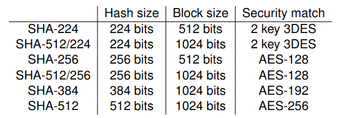
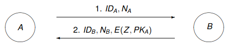
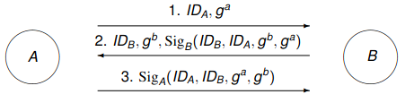
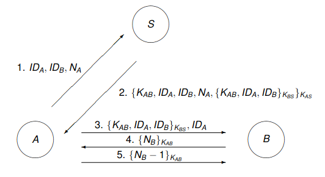
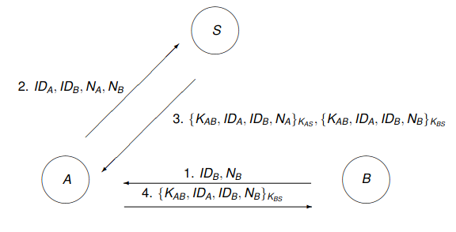
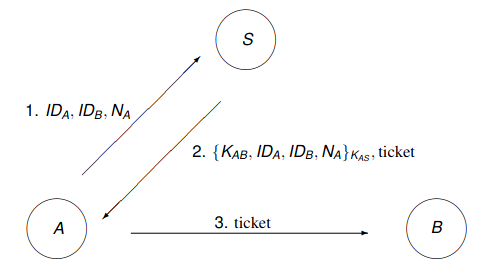
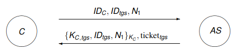
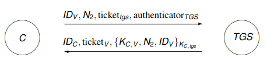
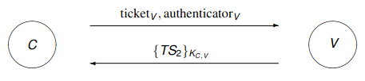

# Applied Cryptography and Network Security

## Definitions

- Privacy
  - Right to a private life
  - Be in control about information about yourself, to be left alone
  - Individual right + social value
- Security
  - Minimizing vulnerabilities of assets and resources
  - *Threat* is a potential violation of security
- CIA triad
  - *Confidentiality*: no unauthed disclosure of info
  - *Integrity*: no unauthed modification/destruction of info
  - *Availability*: resources accessible when required by authed user
- Threat
  - 2 types
    - Passive threat
      - Does not interact with system
      - Eavesdropping
      - Traffic analysis
    - Active threat
      - Attackers alter information in system
      - Masquerade: attacker claims to be different entity
      - Replay: attacker sends message which has already been sent
      - Modification of messages
      - DoS: attacker prevents legitimate users from accessing resource
- Security service
  - Service that gives a specific kind of protection
  - *Peer entity auth*: confirmation of claimed identity of an entity
  - *Data origin auth*: confirmation of origin of message
  - *Access control*: potection against unauthed use of resources
  - *Data confidentiality*: protects against unauthed disclosure
  - *Traffic flow confidentiality*: protects disclosure of data which can be derived from knowledge of traffic flows
  - *Data integrity*: detects modification, insertion, deletion or replay of data
  - *Non-repudiation*: protects against attempts of creator to falsely deny creating data
  - *Availability service*: protects against DoS
- Security mechanism
  - Method for implementing one or more security services
  - Encipherment (same as encyption I think)
  - Digital signature mechanisms
    - Transform data using signing key
  - OSI standard X.800 describes access control mechanisms and data integrity mechanisms
  - Authentication exchange mechanisms: ensure identity of protocol participants (e.g. TLS)
  - Traffic padding: protect against traffic analysis
  - Routing control mechanisms: use specific routes
  - The notarization mechanism: use trusted 3rd parties (notary) to assure source or receipt of data
  - 
- Risk management
  - Key tool for security management
  1. Identify threats
  2. Classify threats accoring to lokelihood and severity
  3. Apply security control based on cost benefit analysis

## Number theory, groups and finite fields

### Factorization

- $a$ divides $b$ if $a\cdot k = b, k\in \Z$
- Prime numbers
- How to test for primality?
  - Find out later
- Properties
  - if $a$ divides $b$ and $a$ divides $c$, then $a$ divides $b+c$
- Euclidean division
  - $a>b \implies \exists !(q, r), a=q\cdot b + r, r<b$
- Greatest common divisor (GCD)
  - Relatively prime if $GCD(a,b)=1$
- Euclidean algorithm
  - $GCD(a,b) = GCD(b, a\mod b)$
- Extended euclidean algorithm
  - FML
  - Back substitution
  - Solve equation $a\cdot x+b\cdot y = d$, ($a,b,d$ known variables, solve for integers $x,y$)

### Modular arithmetic

- Definition
  - You know the modulus operator
  - Be aware of calculation rules
- Residue class
  - Set $\{r_0, \dots, r_{n-1}\}$ is *complete set of residues* modulo $n$ of for every integer $a, a\mod n = r_i$ for exactly one $r_i$
  - Set $\{0, \dots, n-1\}$ form complete set of residues modulo $n$ since $a=q\cdot n+r, 0\leq r \leq n-1$
    - Denoted by $\Z_n$
    - $\Z_n^*$ is $\Z_n$ without 0

### Groups

- Set, $G$, with binary operation, $\cdot$, satisfying following conditions
  - Closure: $a\cdot b \in G \forall a,b\in G$
  - Identity: Exists element, $1$, such that $a\cdot 1 = 1\cdot a = a \forall a\in G$
  - Inverse: $\forall a \in G, \exists b\in G a\cdot b=1$
  - Assiciative: For all $a,b,c \in G, (a\cdot b)\cdot c = a\cdot (b\cdot c)$
  - Abelian groups are also commutative ($a\cdot b = b\cdot a \forall a,b\in G$)
- Cyclic groups
  - Order of group, $|G|$ = number of elements
  - Order of element $g\in G = |g|$, is smallest integer $k$ with $g^k\equiv_{|G|+1} 1$
  - Group element $g$ is a generator for $G$ if $|g|=|G|$
  - Group is cyclic if it has generator
  - Example:
    - Set:$\{0,1,2,3,4\}$
    - $|G|=5$
    - Generator is 2, since $2^k\mod 5$ creates the set for $k\in {1,2,3,4}$ (disregard the 0 in the set for multiplicative cyclic fields)
  - Cyclic group is always abelian, e.g. commutative
- Inverse modulo
- $ax\equiv_n 1$, $x$ is inverse of $a$
  - $a^{-1}\mod n$
- Has to be invserse if $gcd(a,n)=1$
- Use extended euclidean alg
  - $ax\equiv_n 1$
  - $a\cdot x+b\cdot y=1$
  - Find some value for $x$
- $\Z_p ^*$
  - Complete set of residues modulo a prime $p$ with 0 removed forms a group under multiplication
  - Properties
    - Order = $p-1$
    - Cyclic
    - Generally many generators
  - Can be represented as the multiplicative group $\{1,2,\dots p-1\}$
  - Finding generator of $\Z_p^*$
    - An element of order $p-1$
    - Lagrange theorem implies order of any element must exactly divide $p-1$
    - To find generator of $\Z_p^*$
      - Compute distinct prime factors of $p-1$, $f_1, f_2, \dots$
      - $g$ is generator as long as $g^{(p-1)/f_i}\neq 1 (\mod p)$ for $i=1,2,\dots$
  - Group of composite modulus, $\Z_n ^*$
    - For any $n$, we define $\>_n^*$ to be group of residues which have inverse under multiplication
    - Not cyclic in general
    - Finding order is difficult

### Fields

- Set, $F$, with binary operations $+$ and $\cdot$, satisfying following conditions
  - $+$ commutative: $a+b = b+a$
  - $F \backslash {0}$ commutative under $\cdot$
  - Distributive  for all $a,b,c\in F: a\cdot(b+c) = (a\cdot b)+(a\cdot c)$
- Finite fields
  - Only interested in fields of finite size
  - Only exists finite fields of size $p^n$, $p$ prime, $n$ int
  - Most interesting:
    - Field if size $p$
    - Field of size $2^n$
- Finite field $GF(p)$ (general field)
  - Often write $\Z_p$ instead of $GF(p)$
  - Multiplication and addition done in modulo $p$
  - Multiplicative group is exactly $\Z_p ^*$
  - Finite field $GF(2)$
    - Contains elements $\{0,1\}$
    - Addition is binary addition $\mod 2$
      - Same as logical XOR
    - Only 1 non-zero element gives trivial multiplicative group
    - Often use XOR, $\oplus$
- Finite field $GF(2^n)$
  - Arithmetic can be considered as polynomial arithmetic where field elements are polynomials with binary coefficients
  - Equate n-bit string to polynomial
    - $010011 = 0\cdot x^5 + 1\cdot x^4 + 0\cdot x^3 + 0\cdot x^2 + 1\cdot x^1 + 1\cdot x^0$
  - Field can be represented in different ways by use of primitive polynomial $m(x)$
  - Addition and multiplication defined by polynomial addition and multiplication $\mod m(x)$
  - Note: polynomial division easy by using shift registers
  - $GF(2^8)$ used for AES block cipher
  - To add two strings we add their coefficients modulo 2
  - Multiplication done with respect to generator polynomial which for AES is $m(x)=x^8+x^4+x^3+x+1$
  - Multiplying two strings is same as multiplying polynomials and taking $\mod m(x)$
- Boolean values
  - Boolean variable $x$ takes either value 0 or 1
  - Boolean function outputs boolean value

## Classical encryption

- Terminology
  - *Cryptography*: study of designing cryptosystems
  - *Cryptoanalysis*: Study of breaking cryptosystems
- Confidentiality and authentication
  - For confidentiality a key is needed to read the message
  - For authenticatino a key is needed to write the message
- Cryptosystems consists of the following:
  - Set of plaintexts
  - Set of ciphertexts
  - Set of keys
  - Function which transforms plaintext into ciphertext (encyption)
  - Function which transforms ciphertext into plaintext (decryption)
- Symmetric key encryption
  - Encryption and decryption key only known to sender and receiver
  - Requires secure channel for transmission of key
- Asymmetric key cipher
  - Each participant has public and private key
  - May allow for both encryption and digital signature
- Symmetric key encryption
  - 
- Public key encryption
  - 
- Digital signatures
  - 
- Notation for symmetric key encryption algs
  - $E$: Encryption function
  - $D$: Decryption function
  - $M$: Plaintext message
  - $C$: Ciphertext/cryptogram
  - $K$: Shared secret key
  - Encryption: $C = E(K,M)$
  - Decryption: $M = D(K,C)$

## Cryptoanalysis

- Considerations
  - What resources does the adversary have
  - What is the adversary's goal
- Methods
  - Exhaustive key search
    - Brute force
    - Attacker tries all possible keys
    - Minimum standard to have brute force be too computationally difficult
- Attack classification
  - **Ciphertext only attack:** attacker knowns only intercepted ciphertext
  - **Known plaintext attack:** attacker knows a small amount of plaintext and its ciphertext equivalent
  - **Chosen plaintext attack:** attacker can select plaintext and its ciphertext equivalent (inside encryptor)
  - **Chosen ciphertext attack:** attacker can obtain plaintext equivalent of some ciphertext (inside decryptor)
  - Modern standard is chosen plaintext/ciphertext should be secured against
- Kerckhoff's principle
  - The security of a cryptosystem must lie only in the choice of the key. Everything else must be assumed to be public knowledge

## Statistics of natural language

- We need to define alphabet of plaintext and ciphertext (usually same alphabet for the two)
- In our case, we use roman alphabet
  - $A=0, B=1, \dots, Z=25$
  - If space is included, it is numbered 26
- Real-world attacker needs to work out the alphabet
- Statistics for English
  - Statistics for the distribution of characters in English plaintext
  - Can be of both single-characeter, double-characters and truple-characters
- Basic cipher operations
  - Most ciphers based on a combination of two basic operations
  - *Transposition*: Mixing up characters in plaintext
  - *Substitution*: Replacing characters with other characters
- Transposition ciphers
  - Permutes characters usually in fixed period, $d$, and permutation, $f$
  - We can consider plaintext as matrix of rows of length $d$
  - Generally transposition ciphers can permute rows or columns
  - Cryptoanalysis
    - Frequency distribution same as for plaintext
    - Small period makes it possible to solve by hand using anagramming
    - Guess value of $d$ and write ciphertext in columns
    - Might optimise trials with knowledge of digram and trigram frequencies
    - Processes can be automated
- Simple substitution ciphers
  - Each character in aplhabet replaced by another character
  - Also called monoalphabetic substitution ciphers
  - Exampe Caesar cipher and random simple substitution cipher

### Caesar cipher

- Key: integer $j$
- For each letter with value $i$ in the alphabet, replace it with $(i+j)\mod n$, where $n$ is size of aplhabet
- Cryptoanalysis
  - Only need to find where one of the most frequent characters are shifted to

### Random simple subtitution cipher

- Replaces all similar characters in plaintext with another character
- E.g. all E become T, A become G, $\dots$
- Cryptoanalysis
  - Can still use frequency analysis
  - Tedious to do cryptoanalysis by hand
  - Better to use tools (like Cryptool)

### Polyalphabetic substitution

- Use multiple mappings from plaintext to ciphertext
- Makes it so that frequency analysis is no longer effective
- Given $d$ ciphertext alphabets $C_0, \dots, C_{d-1}$, let $f_i: A\rightarrow C_i$ be mapping from plaintext alphabet $A$ to $i$th ciphertext alphabet $C_i(0\leq i\leq d-1$
- Encryption process
  - Plaintext message $M=m_0m_1\dots m_{d-1}m_d\dots m_{2d-1}\dots$
  is enciphered to $E(K,M)=f_0(m_0)f_1(m_1)\dots f_{d-1}(m_{d-1})f_0(m_d)\dots$
  - $d=1$ gives monoalphabetic substitution
- Random polyalphabetic substitution cipher
  - Key generation
    - Select block length $d$
    - Generate $d$ random simple substitution tables
  - Encryption
    - Encrypt character $i$ (message index, not alphabet index), use substitution table $j$ where $i\equiv_d j$
  - Decryption
    - Use same substitution table as in encryption to reverse simple substitution
  - Example with $d=3$
    - 

### Vigenère cipher

- Key $K$ is specified by sequence of characters $K=k_0k_1\dots k_{d-1}$, where $k_i$ gives amount of shift on $i$th alphabet
  - $f_i(p)=(p+k_i)\mod n$, where p is plaintext character
  - Used to be widely believed to be unbreakable
- Cryptoanalysis
  - Identify period length
    - Kasiski method
    - Autocorrelation
    - Index of coincidence
  - Attack using $d$ different substitution tables
  - Identifying period using autocorrelation
    - Given ciphertext $C$ compute correlation between $C_i$ for all plausible values $i$ of the period
    - English is non-random, meaning there is better correlation between two texts of same size shift than between two texts with different size shifts
    - Therefore we expect to see peaks in value of $C_i$ when $i$ is a multiple of the period
    - Plotting result on histogram can allow us to identify period
    - Can be used to find period for any periodic polyalphabetic cipher
  - Example with Kasiski:
    - 
    - String PELPEK and WIKCIO occur multiple times
    - Positions of strings separated by 117 and 93 characters
    - Period is almost certainly common divisor for these 2 numbers $\implies$ period is either 1 or 3
    - Then attack using separate alphabets
    - From here on out it is like caesar cipher just multiple times

### Other polyalphabetic ciphers

- Autokey cipher
  - Starts off as Vignère, but once alphabet defined by key has been used once, uses plaintext to define subsequenct alphabets
  - Therefore not periodic
- Running key cipher
  - Uses practically infinite set of alphabets from shared key
- Rotor machines
  - Early 20th century electromagnatic machines were developed for encryption using rotors as moving alphabets
  - E.g. enigma machine during WW2
  - Each character encrypted using different alphabet. Enigma machine period of ~17000, in practice never repeating same message

## Hill cipher

- Performs linear transformation on $d$ plaintext characters to get $d$ ciphertext characters
- Multiplies block of plaintext, $P$ with $d\times d$ matrix $K$ to make cipher block $C$
  - If insufficcient letters we use padding with uncommon letter like Z
  - Multiplication is done modulo length of the alphabet
- Decryption is done by multiplying $C$ with $K^{-1}$
- Encryption: $C = K\cdot P$
- Decryption: $P = K^{-1}\cdot C$
- Note that matrices are made using numbers equal to the index of the letters (A=0, B=1, $\dots$)
- Example:
  - $d=2$
  - $K = \begin{pmatrix}
    4 & 5 \\
    1 & 7
  \end{pmatrix}$
  - $K^{-1} = \begin{pmatrix}
    15 & 19 \\
    9 & 16
  \end{pmatrix}$ (can be found by hand using Gauss elimination)
  - Encrypting digram BC = $\begin{pmatrix}
    1 \\ 2
  \end{pmatrix}$
  - $C = K\cdot P = \begin{pmatrix}
    4 & 5 \\
    1 & 7
  \end{pmatrix} \cdot \begin{pmatrix}
    1 \\ 2
  \end{pmatrix} = \begin{pmatrix}
    14 \\ 15
  \end{pmatrix} \rightarrow$ OP
- Cryptoanalysis
  - Known plaintext attack possible given $d$ plaintext-ciphertext matching blocks (and attacker knows $d$)
  - Suppose we are given column vectors $P_i, C_i, i=0,1,\dots, d-1$
  - $C=[C_0, C_1, \dots, C_{d-1}], P=[P_0, P_1, \dots, P_{d-1}]$
  - Solve $C=K\cdot P$ for $K$
  - $P = K^{-1}\cdot C$
  - Ciphertext only attacks are possible with added task of finding probable blocks of matching plaintext and ciphertext

## Stream ciphers

- Generation of keystream of any required length
- Each element in keystream used successively to encrypt one or more ciphertext characters
- Usually symmetric key ciphers
- Keystream must have good randomness properties
- Synchronous key ciphers
  - In simple kinds of stream cipher the key is generated independently of the plaintext
  - Both sender and receiver need to generate the same keystream
  - Vigenère cipher can be seen as periodic synchronous stream cipher
- Binary synchronous key cipher
  - For each time interval $t$, the following are defined
    - Binary sequence $s(t)$ called keystream
    - Binary plaintext $p(t)$
    - Binary ciphertext $c(t)$
  - Encryption: $c(t) = s(t) \oplus p(t)$
  - Decryption: $p(t) = s(t) \oplus c(t)$

## One time pad

- Key is truly random sequence of characters, all independently generated
- Each character in key is used one time only
- Provides perfect secrecy
  - Perfect secrecy achieved when $P(M_i | C_j) = P(M_i)$
  - In other words getting hold of the ciphertext does not make it easier to decipher the message
- Example in roman alphabet
  - Plaintext characters $p_1, \dots, p_r$
  - Ciphertext charcters $c_1, \dots, c_r$
  - Keystream: random characters $k_1, \dots, k_r$
  - Encryption: $c_i = (p_i + k_i)\mod 26$
  - Decryption: $p_i = (c_i - k_i)\mod 26$
- Even if ciphertext $C_j$ is observer, there is no way of telling which plaintext it originates from
- Vernam (binary) one time pad
  - Encryption: $c_i = k_i \oplus p_i$
  - Decryption: $p_i = k_i \oplus c_i$
- One time pad properties
  - Any cipher with perfect secrecy must have as many keys as there are messages
    - In this sense one time pad is only unbreakable cipher
  - Practical usage possible for pre-assigned communications between fixed parties
  - Main issue is how to deal with key management
  - Key generation, transportation, synchronization, destruction problematic due to long keys
  - In Caesar cipher, the key was one integer, now it is length of message
- Two-time pad
  - Cannot use same key twice!
  - $C_1 = K\oplus P_1$
  - $C_2 = K\oplus P_2$
  - Note for ciphertext only attack, $C_1$ and $C_2$ are known
  - Trick: $C_1 \oplus C_2 = K\oplus P_1 \oplus K\oplus P_2 = P_1 \oplus P_2$
  - We can get information about plaintext only from ciphertext!!!
- Visual cryptography
  - Splits image into to shares
  - Decryption by overlaying two shared images
  - Each share reveals no information about image
  - 

## Block ciphers

- Main bulk encryption algorithms
  - AES and DES widely employed
- Symmetric key ciphers in which each block of plaintext is encrypted with same key
- *Block* = set of plaintext symbols of a fixed size
  - Typically size between 64 and 256 bits
- Used in practice in configuration called modes of operation
- Notation going forward:
  - $P$: plaintext block of length $n$
  - $C$: ciphertext block of length $n$
  - $K$: key of length $k$
  - $C = E(P, K)$: encryption function
  - $P = D(C, K)$: decryption function
- Criteria for cipher block design
  - 2 important encryption techniques
  - *Confusion*: involves substitution to make relationship between key and ciphertext complex
  - *Diffusion*: involves transformations that dissipates statistical properties of plaintext across ciphertext

### Product cipher

- Cryptosystem in which encryption function is formed by applying or composing several sub-encryption functions
- E.g. we define multiple functions $f_1, f_2, \dots F_r$, that have keys $K_1, K_2, \dots K_r$
- $C = E(P, K) = f_r(f_{r-1}(\dots f_2(f_1(P, K_1), K_2)\dots K_{r-1}), K_r)$

### Iterated ciphers

- Special class of product ciphers
- Most modern block ciphers
- Encryption process divided into $r$ different *rounds*
- Sub-encryption functions are all the same function, $g$, called *round function*
- Each key $K_i$ is derived from the overall master key $K$
- $K_i$ are called *round keys* or *subkeys* and are derived from $K$ using a $key schedule$ process
- Encryption
  - $W_0 = P \newline
    W_1 = g(W_0, K_1) \newline
    W_2 = g(W_1, K_2) \newline
    \dots \newline
    C = W_r$
- Decryption
  - $W_r = C \newline
    W_{r-1} = g^{-1}(W_r, K_r) \newline
    W_{r-2} = g^{-1}(W_{r-1}, K_{r-1}) \newline
    \dots \newline
    P = W_0$
- Types of iterated ciphers
  - *Feistel ciphers*: e.g. Data Encryption Standard (DES)
  - *Substitution-permutation networks (SPNs)*: e.g. Advanced Encryption Standard (AES)

### Feistel cipher

- Iterated cipher in which the round function swaps the two halves of the block and forms new right hand half
- Sometimes called feistel network, since process can be seen as network in which two halves travel through
- Encryption
  - Split plaintext clock $P=W_0$ into two halves, $W_0 = (L_0, R_0)$
  - For each round, perform:
    $L_i = R_{i-1} \newline
    R_i = L_{i-1} \oplus f(R_{i-1}, K_i)$
  - $C = (L_r, R_r)$
  - 
- Decryption
  - Ciphertextblock $C=(L_r, R_r)$
  - For each of the $r$ rounds, perform:
    $L_{i-1} = R_i \oplus f(L_i, K_i) \newline
    R_{i-1} = L_i$
  - $P = (L_0, R_0)$
- Note that we never have to invert $f$, so any function works
- Still, choice of $f$ is critical, as it is the only non-linear part of the encryption

### Substitution-Permutation Networks (SPNs)

- Iterated network cipher
- Block length $n$ must allow each block to be split into $m$ sub-blocks of length $l$ such that $n=l\cdot m$
- 2 permutations defined
  - $\pi_S$ operates on sub-blocks of size $l$ bits:
    $\newline \pi_S: \{0,1\}' \rightarrow \{0,1\}'\newline$
    Called an S-box (substitution box)
  - $\pi_P$ swaps inputs from $\{1,\dots, n\}$, similarly to transposition cipher
    $\newline \pi_P: \{1,2,\dots, n\} \rightarrow \{1,2,\dots, n\}$
- Steps in SPN round function
  - Round key $K_i$ is XORd with current state block $W_i$
  - Each subblock is replaced by application of $\pi_S$
  - Whole block is permuted using $\pi_P$
  - 

### Standard security properties

- Avalanche effects
  - Good block ciphers exhibit avalanche effects with respect to both key and plaintext
  - *Plaintext avalanche*
    - Small change in plaintext should amount to large change in ciphertext
    - Ideally, changing one bit in plaintext changes half of the bits in the output block
    - Can relate to Shannon's notion of diffusion
  - *Key avalanche*
    - Small change in key should amount in large change in ciphertext
    - Can relate to Shannon's notion of confusion
- Differential cryptoanalysis
  - Powerful technique from the 90's
  - Chosen plaintext attack
  - Based on idea that difference between two input plaintexts can be correlated to difference between two output ciphertexts
- Linear cryptoanalysis
  - Known plaintext attack from 90's
  - Can theoretically break DES
  - Modern block ciphers typically immune to differential and linear cryptoanalysis

### Data Encryption Standard (DES)

- 1977: US standard for encryption
- Encryption and decryption definitions are public property
- Security resides in difficulty of encryption without knowledge of the key
- 16-round feistel cipher with key length = 56 bits, data block length = 64 bits
- Encryption
  - $P$: 64-bit input block
  - 64 bits of $P$ er permuted accordingly to an initially fixed permutation, denoted $IP$
  - 16 rounds of feistel operation applied, denoed by funcion $f$. Different 48-bit subkey used for each round
  - Final fixed inverse permutation, $IP^{-1}$ applied after 16 rounds, and result is ciphertext $C$
- DES feistel operation
  - Expand 32 bits to 48 bits
  - Bitwise XOR 48 bits to round subkey
  - Break 48 bits into 8 blocks of 6 bits each
  - Put block $i$ into substitution table $i$ outputting block with length 4 bits
  - Apply permutation to resulting 32 bits
  - 
- S-box example
  - 
  - Input block $B$ is $x_0x_1x_2x_3x_4x_5$
  - $x_0$ and $x_5$ define row number (0-3)
  - $x_1x_2x_3x_4$ define column number (0-15)
- Key schedule
  - Each of the 16 rounds involved 48 bits out of the 56 bit key
  - Each 48b subkey is defined by a series of permutations and shifts in full 56b key
- Brute force attack on DES
  - Testing all of the $2^k$ keys to find key $K$
  - Right key can be identified by using small number of ciphertext blocks, or looking for low entropy in decrypted plaintext
  - In DES there are $2^{56}$ keys to test, meaning it will take an average of $2^{55}$ trials to find the right key
  - As technology evolved, this became insecure
    - In 2007 a machine was built that can break 56-bit key in less than 1 week
- Double encryption
  - Principle: keys $K_1, K_2$, $C=E(E(P, K_1), K_2)$
  - Now requires $2^{2k-1}$ trials on average
  - Meet-in-the-middle method reduces time-memory trade off
    - Suppose we have ciphertext/plaintext pair $(P,C)$
    - For each key, store $C' = E(P,K)$ in memory
    - Check whether $D(C,K') = C'$ for any key $K'$
    - $K$ is $K_1$, and $K'$ is $K_2$
    - Check whether key values from previous step work for other $(P,C)$ pairs
    - Requires storage of one plaintext block for every possible key
    - Expensive, but much easier than computing $2^{111}$ keys
- Triple encryption
  - Provides much better encryption
  - Three keys $K_1, K_2, K_3$
  - Encryption defined by $C=E(D(E(P, K_1), K_2), K_3)$
  - Secure from meet-in-the-middle attack
    - If $E$ has strong pseudo-random properties, so does $D=E^{-1}$
- Standardised options
  - 1999 version of DES specified 3 options
    - Use 3 independent keys (most secure)
    - $K_1 = K_3$ (secure enough)
    - $K_1=K_2=K_3$ (backward compatible with single DES, vulnerable)
  - From 2019:
    - 2-key DES only allowed for legacy purposes
    - 3-key DES allowed in existing applications only, from 2023 legacy only

### Advanced Encryption Standard (AES)

- AES designed in open competition due to controversy over DES
- Algorithm
  - Symmetric key block cipher
  - 128b data block
  - 128b, 192b or 256b master key
  - 10, 12 or 14 rounds (depending on master key size, I think)
  - Byte based design
  - Essentially substitution-permutation network
  - Mixture of field operations in $GF(2^8)$ and bit string operations
- Round transformations
  - 4 basic operations:
    - ByteSub (non-linear substitution)
    - ShiftRow (Permutation)
    - MixColumn (Diffusion)
    - AddRoundKey
  - Essentially substitution-permutation network with $n=128, l=8$
  - S-box is look-up table but mathematically defined in $GF(2^8)$
  - See slides for example
- Key schedule
  - Each round uses 128b subkey
  - Number of subkeys required is one for each round plus an initial subkey
    - 128b key means 11 subkeys required
  - Key schedule derives 11 128b subkeys from 128b master key
- AES security
  - Some cracks have appeared, but no breaks
  - Attacks exist on reduced-round versions
  - *Related-key attack* exists. Require attacker to obtain ciphertext encrypted with a key related to actual key in some way
  - Most serious real attacks reduce effective key size by around 2 bits
- Comparison to DES
  - Block size
    - DES - 64b
    - AES - 128b
  - Key size
    - DES - 56b
    - AES - 128, 193 or 256b
  - Design structure
    - Both iterated ciphers
    - DES feistel structure, AES SPN
    - DES bit-based, AES byte-based
    - AES significally faster in both hardware and software

## Modes of operation and random numbers

- Motivation
  - Block ciphers encrypt single blocks of data separately, which is generally insecure
  - Modes of operation standardized iwth different security and efficiency
  - Block ciphers can be used to generate random numbers

### Modes

- Purpose
  - Modes can be designed to provide confidentiality or authentication or both for data
  - Some modes can be used to generate pseudorandom numbers
  - Different modes have different properties
- Importance of randomized encryption
  - Dangerous if same text is encrypted to same ciphertext every time
    - Makes it possible to find patterns
    - *Randomizing* encryption schemes prevent this
    - Typically achieved through initialization vector, $IV$, which propagates through the entire ciphertext
    - $IV$ needs to be unique and/or random
    - Another way to vary the encryption is to include variable state which updates with each block
- Efficiency
  - Many important features of different modes which do not impact security but are important for practical use
  - Some modes allow parallell processing
    - Sometimes multiple plaintexts can be encrypted in parallel
    - Sometimes multiple ciphertexts can be decrypted in parallel
  - Some modes result in error propagation, where bit error in ciphertext results in multiple bit errors in decrypted plaintext
- Padding
  - Some modes require plaintext to consist og one or more complete blocks
  - Padding mechanism to "fill up" a block (NIST)
    - Append single bit '1' to data string (regardless of whether the message was already complete)
    - Pad resulting string by '0' to complete the block
  - Padding bits can be removed unambiguously, if receiver knows padding mechanism
  - Alternative to padding is *ciphertext stealing*
- Notation:
  - $n$: amount of blocks in message
  - $P$: plaintext message
  - $C$: ciphertext
  - $P_t$: plaintext block number $t, 1\leq t\leq n$
  - $C_t$: ciphertext block number $t, 1\leq t\leq n$
  - $K$: key
  - $IV$: initialization vector
- NIST standards
  - 4 modes ECB, CBC, CFB, OFB, CTR
  - See slides for more info (not sure if relevant)
- Electronic Code Book (ECB)
  - Encryption
    - $C_t = E(P_t, K)$
  - Decryption
    - $P_t = D(C_t, K)$
  - Same key used for each block
  - Properties
    - Not randomized
    - Padding required
    - Error propagation within blocks
    - No IV
    - Parallel encryption/decryption
  - Encryption with ECB might reveal patterns in plaintext
- Cipher Block Chaining (CBC)
  - "Chains" block together
  - Random $IV$ chosen and sent together with ciphertext blocks
  - Encryption
    - $C_t = E(P_t\oplus C_{t-1}, K), C_0 = IV$
  - Decryption
    - $P_t = D(C_t, K)\oplus C_{t-1}, C_0 = IV$
  - Properties
    - Randomized
    - Padding required
    - Error propagates within blocks and into specific bits in next block
    - $IV$ must be random
    - Parallel decryption, not encryption
  - Commonly used for bulk encryption
- Ciphertext FeedBack (CFB)
  - Feeds ciphertext block back into enciphering/deciphering process, "chaining" the blocks together
  - Encryption
    - $C_t = E(C_{t-1}, K) \oplus P_t, C_0=IV$
  - Decryption
    - $P_t = D(C_{t-1}, K)\oplus C_t, C_0=IV$
  - Propagation of channel errors
  - One bit error in $C_t$ produces one bit error in $P_t$ and corruption of $P_{t+1}$
  - Self-synchronizing stream cipher
    - Keystream depend on previous ciphertexts
    - Loss in synchronicity for one block if ciphertext block is lost in transmission
  - Properties
    - Randomized
    - Padding not required
    - Error propagates to specific bits in current block and propagates into next block
    - $IV$ must be random
    - Parallel decryption, not encryption
- Output FeedBack (OFB)
  - "Feeds" output block back into encryption/decryption process
  - Synchronous stream cipher, keystream $O_t = E(O_{t-1}, K), O_0=IV$
  - Encryption
    - $C_t = O_t\oplus P_t$
  - Decryption
    - $P_t = O_t\oplus C_t$
  - Properties
    - Randomized
    - Padding not required
    - Error propagates from one bit in ciphertext to same bit in decrypted plaintext
    - $IV$ must be unique
    - No parallel encryption or decryption
      - Keystream can be computed in advance
- Counter (CTR)
  - Synchronous stream cipher
  - Keystream generated by encrypting successive values of a counter, using nonce $N$
  - $O_t = E(T_t, K), T_t = N||t$ (concatenation)
  - Encryption
    - $C_t = O_t\oplus P_t$
  - Decryption
    - $P_t = O_t\oplus C_t$
  - Properties
    - Randomized
    - Padding not required
    - Error propagates from one bit in ciphertext to same bit in decrypted plaintext
    - $IV$: nonce must be unique
    - Parallel encryption and decryption
  - Good for access to specific plaintext blocks without having to decrypt the entire thing
  - Basis for authenticated encryption in TLS 1.2 and 1.3

### Random numbers

- Principles of pseudo-random number generation
  - Strong randomness is crucial in cryptography
  - Statistical notions
    - Uniform distribution: frequency of ones and zeros should be approximately equal
    - Independence: no output should be predictable given previous output
- Randomness in cryptography
  - Truly random numbers used some places, but they have drawbacks like inefficiency
  - More common with pseudorandom
  - Most important is that adversary cannot predict future numbers
  - Algorithmic techniques for random number generation
    - Deterministic, not statistically random sequence
- Randomness in general
  - Any specific string is exactly as random as any other
  - Therefore we look at distributions
  - We look at generators of random strings
    - True random number generator (TRNG) is physical process which outputs each valid string independently with equal probability
    - Pseudo random number generator (PRNG) is approximately a TRNG
  - Can use TRNG to provide *seed* for PRNG
  - NIST privides framework for design and validation of TRNG algorithms called *entropy sources*
  - Entropy source is physical noise source, with output being any number of bits
  - *Health test* important to ensure continuing reliable operation
  - NIST recommends certain PRNG algs named *Deterministic Random Bit Generators* (DRBG) based on:
    - Hash functions
    - HMAC (specific type of MAC)
    - Block ciphers in counter mode
  - Each generator takes seed as input and outputs bit string updating its state
  - Seed should be updated after some number of calls
  - Seed can be obtained from TRNG
- Functions of DRBGs
  - NIST defines general model for DRBGs with these functions
    - Instantiate: sets initial state of DRBG using a seed
    - Generate: provides output bit string for each request
    - Reseed: inputs new random seed and updates state
    - Test: checks correction operation of other functions
    - Uninstantiate: deletes "zeroises" in state of the DRBG
- Security of DRBG
  - Defined in terms of ability for hacker to distinugish reliably between its output and a truly random string
  - *Backtracking resistance*: attacker who gains access to current state of DRBG should not be able to distinguish between output of earlier calls of DRBG and random strings
  - *Forward prediction resistance*: attacker who obtains access to current state of DRBG should not be able to distinguish between output of later calls and random strings
- CTR_DRBG
  - Uses block cipher in CTR mode
  - E.g. AES with 128b keys
  - DRBG initialized with seed with length equal to key length + block length
    - AES that becomes 128b + 128b = 256b
  - Key $K$ and counter value $V$ derived form high entropy seed. No separate nonce as in normal CTR mode
  - Then run counter mode encryption iteratively
  - Update function
    - Used to generate new key and state
    - Used in initialize, generate and reseed function
    - Input: Current key $K$, state (counter) $V$, optional data input $D$
    - Output: New key $K'$, new state $V'$
    - Block and key size same:
      - Generate ew block $O_1 = E(V, K)$
      - Increment $V$
      - Generate new block $O_2 = E(V, K)$
      - $K'||V' = (O_1||O_2)\oplus D$
    - Updating provides backtracking resistance
  - Instantiate
    - Calls Update function with $D$ equal to high entropy seed, $K=V=0$
  - Generate
    - Computes up to $2^{19}$ bits by running CTR mode output from current state
    - Then call Update with $D=0$
  - Reseed
    - Call Update with $D$ equal to high entropy input, $K$ and $V$ in current state
  - Standard says Generate can be called up to $2^{48}$ times before Reseed must be called
  - Each Reseed call provides forward prediction resistance and backtracking resistance
- Dual_EC_DRBG
  - Older standard
  - Based on elliptic curve discrete logarithm problem
  - Much slower than DRBG in the standard
- Cloudflare
  - Company in San Francisco
  - Provide
    - CDN services
    - Cloud cybersecurity
    - DDoS mitigation
  - Used by more than 20\% of the internet
- How to generate randomness
  - CryptographicallySecure PseudoRandom Number Generators (CSPRNGs) are algs which produce larger stream of unpredictable data from smaller unpredictable input
  - Need unpredictable input
- Lavarand (fun alternate RNG generator)

## Hash functions, MACs and authenticated encryption

### Hash functions

- Public function $H$ such that
  - $H$ is simple and fast to compute
  - $H$ takes an input $M$ pf arbitrary length and outputs message digest $H(M)$ of fixed length
- Security properties
  - Collision resistant: Should be infeasible to find $x_1$ and $x_2$ such that $H(x_1) = H(x_2)$
  - One-way: Should be impossible to find $x$ such that $H(x) = y$ given $y$
  - Second-preimage resistant: Given value $x_1$, it should be infeasible to find $x_2$ such that $H(x_1) = H(x_2)$
    - Breaking second-preimage restistance implies breaking collision resistance
- Remember birthday paradox
  - In general, if we choose around $\sqrt{M}$ values from a set of size $M$, the probability of getting two of the same value is around 0.5
  - Suppose hash function has output size $k$ bits, and $H$ is regarded as random, $2^{k/2}$ trials are enough to find collision
  - Today, $2^{128}$ trials is considered infeasible. As such, hash function outputs should be at least 256 bits
- Iterated hash functions
  - Splits input into blocks of fixed size and operates each block sequentially using same function with fixed size inputs
  - Merkle-Damgård construction: use fixed-size compression function applied to multiple blocks of the message
  - Compression function $h$
    - Takes 2 input strings $x_1, x_2$ and outputs string $y$ of length $n$ bits
  - 
  - If conpression function $h$ is collision-resistant, then hash function $H$ is collision resistant
  - Security weakness
    - Length-extension attack: once one collision is found, it is easy to find more
    - Second-preimage not as hard as it should be
  - Many standards are Markle-Damgård constructions
- Standarized hash functions
  - MDx family
    - Deployed members were MD2, MD4, MD5
    - All have 128 bit output
    - All broken
  - SHA-0 and SHA-1
    - Based on MDx but larger output and more complex
    - SHA = Secura Hash Algorithm
    - Both have 160 bit output
    - SHA-0 broken
    - Sha-1 fisrt collision found in 2017
  - SHA-2 family
    - Several members
    - Developed in response to attack on MD5 and SHA-1
    - 
    - Padding in SHA-2 family
      - Message length field is
        - 64b if block length=512b
        - 128b when block length=1024b
      - Always at least one padding
        - First a "1", then "0" until complete block
  - SHA-3
    - Does not use Merkle-Damgård, but *sponge* contruction
      - Input padded and broken down into block or $r$ bits
      - The $b$ bits of the state are initialized to 0, and sponge function proceeds
        - Absorption phase: input blocks XORd into $r$ first bit of state, and function $f$ applied iteratively
        - Squeezing phase: first $r$ bits of state returned as output blocks, interleaved applying function $f$
          - Number of output blocks chosen by user
          - Last $c$ bits of state never directly affected by input blocks and never output during squeezing phase
        - Since input/output sizes can be arbitrarily long, sponge construction can be used to build various primitived
      - Keccak function: 
- Usecases of hash functions
  - NOT encryption
  - Can authenticate message by authenticating hash
  - Building block for Message Authentication Codes (MACs)
  - Building block for signatures
  - Hash functions and keys
    - Sometimes we write hash functions as taking key $s$ as input
    - $H^s(x) = H(s, x)$
    - Must be hard to find collision for randomly generated key $s$
    - Key is **not** kept secret. Need collision resistance even when adversary knows $s$
      - Hence $H^s$, and not $H_s$
  - Storing passwords for login
    - Usual to store passwords on servers using hash functions
    - Store salted hashes of passwords, using random $salt$, computing $h = H(pw, salt)$, store $(salt, h)$

### Message authentication codes (MACs)

- Goal is to enable *secure communication*
- So far covered secrecy
- But we also need integrity
- We need to ensure messages are not altered during transmission
- Flipping certain bits in ciphertext results in flipping certain bits in plaintext
  - If adversary has partial information about plaintext, then can predict with some accuracy what the changes are
    - Even OTP vulnerable to this
    - Does not mean encryption scheme is not secure
  - Adversary can randomly change ciphertext to ruin underlying message
- MACs are cryptographic mechanism used for message integrity and authentication
- Inputs secret key $K$ and message $M$ and outputs fixed-length tag $T$ using $MAC$ function
  - $T = MAC(M, K)$
- $MAC$ is symmetric key algorithm
- Sender sends $(M, T)$ pair, but $M$ may or may not be encrypted
- Recipient recomputes tag $T' = MAC(M', K)$ and checks that $T' = T$
- Mac properties
  - Unforgeability
  - Infeasible to produce $M$ and $T$ without knowledge of $K$
- More complete notion of security is unforgeability under chosen message attack
  - Attacker can get tag $T$ of any message $M$ of their choosing
  - Not feasible for attacker to produce valid $(M, T)$ pair that was not already computed before
- Not a signature scheme, but kind of a symmetric version of signature scheme. Only authorized entities can authenticate message
- MAC from hash function (HMAC)
  - Let $H$ be any iterated cryptographic hash function
  - Now define $HMAC(M, K) = H((K\oplus opad) || H((K\oplus ipad) || M))$
  - Definitions:
    - $M$: message
    - $K$: key padded with 0s to be block size of $H$
    - $opad$: fixed string $0x5c5c\dots 5c$
    - $ipad$: fixed string $0x3636\dots 36$
  - Security of HMAC
    - Secure (unforgeable) is $H$ is collision resistant or if $H$ is pseudorandom function
    - Designed to resist length extention attacks (even if $H$ is Merkle-Damgård hash function)
    - HMAC often used as pseudorandom function for deriving keys in cryptographic protocols

### Authenticated encryption

- Suppose Alice and Bob have shared key $K$
- She wants to send with both confidentiality and authentication/integrity
- Two options
  - Split key into two parts, using the first part to encrypt, and use second half with MAC to provide auth and integrity
  - Use dedicated algorithm which procides both properties (authenticated encryption)
- Combining encryption and auth
  - 3 ways
    - Encrypt and MAC ($C || T$, tag of $M$)
      - Integrity only on plaintext, which is bad
      - May not achieve basaic levels of secrecy
      - Even strongly secure MAC does not guarantee anything about secrecy
      - MAC may leak info about $m$ in the tag $t$
    - MAC then encrypt (Encrypt $M || T$)
      - Only plaintext integrity, but now MAC is encrypted
      - We pad message with tag, which can lead to errors in decryption
        - Padding may be incorrect
        - Tag may not verify
      - Attacker can distinguish between failures and get information
      - Attack has been carried out against some TLS configurations
    - Encrypt then MAC ($C || T$, tag of $C$)
  - Encrypt then MAC is safest approach
  - Note that separate keys are used in encryption and MAC
  - Authenticated Encryption with Associated Data (AEAD)
    - Symmetric key cryptosystem
    - Input: message $M$, assosiated data $A$, shared key $K$
    - Output: $O$, which may contain different elements like ciphertext and tag
    - Sender send $O$ and $A$ to recipient
    - Receiver gets either $M$ or $A$ or reports failure
    - AEAD should provide
      - Confidentiality for $M$
      - Auth for both $M$ and $A$
- Galois Counter Mode (GCM)
  - Block cipher mode providing AEAD
  - Most commonly used in web-based TLS
  - Combines CTR mode on block cipher (typically AES) with special keyed hash function GHASH
  - GCM using AES can be faster than AES with HMAC due to HW support
  - Algorithm
    - GHASH uses multiplication in finite field $GF(2^{128})$
      - Generates polynomial $x^{128}+x^7+x^2+1$
    - Input: plaintext $P$, authenticated data $A$, nonce $N$
    - Values $u$ and $v$ are minimum number of 0s required to expand $A$ and $C$ to complete blocks
    - Output: Ciphertext $C$ and tag $T$. Length of $A (len_a)$ and $C (len_C)$ are 64b values
    - In TLS, $len_T=128$b, and $len_N=96$b. Initial block input in CTR mode of $E$ is $J_0 = N || 0^{31} || 1$
    - Function $inc_{32}$ increments right-most 32 bits of input stirng by 1 modulo $2^{32}$
    - GCM: 
    - GHASH: 
      - Outputs $Y_m = GHASH_{HK}(X_1, \dots, X_m)$
      - Operation $\bullet$ is multiplication in finite field $GF(2^{128})$
      - $KH = E(0^{128}, K)$ is hash subkey
  - Decryption
    - Input: ciphertext $C$, tag $T$, authenticated data $A$
    - Receiver knows key $K$ that is used to compute $T$. User can compare computed tag with received tag to check validity of data
    - If tag is correct plaintext can be computed by generating same key stream from CTR mode as is used for encryption

### Passwords and hashing

- Need high-entropy secrets
- Humans can only memorize low-entropy passwords
- Uses of passwords
  - Login
  - Key derivation (e.g. disk encryption)
- Dictionary attacks against passwords
  - Attack knows dictionary of most used passwords
  - Iterate through dictionary from most frequent to least
- Storing login passwords
  - Bad idea to store plaintext
  - Store password encryption using secret key
    - Where to store key?
  - Store hashes of passwords: $h = H(pw)$
    - Good because hard to recover password from hash, assuming $H$ is preimage resistant
    - Bad if attacker can store dictionary of $pw, H(pw)$ and compare with stolen $h$
  - Store salted hashes of password with random $salt$
    - Now attacker needs new dictionary for each $salt$
    - Still does not slow down per-password attacks

## Number theory for public key cryptography

- Need efficient way to generate large prime numbers
- Also need hard copmutational problems

### Chinese remainder theorem (CRT)

- Let $d_1, \dots, d_r$ be pairwise relatively prime
- Let $n=d_1d_2\dots d_r$
- Given any integers $c_i$ there exists a unique integer $x$ such that
  - $x \equiv c_1 (\mod d_1)$
    $x \equiv c_2 (\mod d_2)$
    $\dots$
    $x \equiv c_r (\mod d_r)$
- $x \equiv \sum_i (\frac{n}{d_i})y_i c_i (\mod n)$, where $y_i \equiv (\frac{n}{d_i})^{-1} (\mod d_i)$
- In words, we want an integer $x$ which satisifies a list of modular equivalents
- See slide 8 for example

### Euler $\phi$ function

- Definition: $\phi(n)$ is the amount of numbers lower than $n$ which are relatevely prime to $n$
  - $\phi(n)$ gives size of $\Z_n^*$
- If $n$ is prime, $\phi(n) = n-1$
- $\phi(pq) = (p-1)(q-1)$ if $p$ and $q$ are distinct primes
- If $n=p_1^{k_1}\cdot p_2^{k_2}\cdot ... \cdot p_t^{k_t}, \phi(n) = \Pi_{i=1}^t p_i^{k_i-1}(p_i-1)$
- Two theorems
  - Fermat
    - If $p$ is prime, $a^{p-1}\mod p = 1$, given $a<p-1$
  - Euler
    - $a^{\phi(n)}\mod n = 1$
    - Note that Fermat is a subclass of Euler

### Testing for primality

- Testing by division is not practical for larger numbers
- A number of fast method are probabilistic
  - Require random input and fail in extraordinary cases
- Deterministic primality test found in 2002
  - Still probabilistic methods used in practice
- Fermat test
  - If we find out $a^{n-1}\mod n\neq 1$ then we know $n$ is not prime
  - This can fail with some probability
  - Repeating with different values for $a$ reduces failure probability
  - Algorithm
    - Input: value $n$ to test for primality, the number of times to test $k$
    - Output: $\text{composite}$ if $n$ is composite, otherwise $\text{probably prime}$
    - Repeat $k$ times:
      1. Pick random $a<n-1$
      2. If $a^{n-1}\mod n\neq 1$, return $\text{composite}$
      3. return $\text{probable prime}$
  - Effectiveness
    - If it returns $\text{composite}$, $n$ is 100\% composite
    - Can return pseudoprime numbers (composite but returns probably prime)
    - Carmichael numbers output $\text{probable prime}$ every time, despite being composite
      - A number $n$ that satisfies $b^{n-1}\mod n = 1$ for all integers $b$
- Miller-Rabin test
  - Same idea as Fermat test
  - Can guarantee to detect composites if run sufficiently many times
  - Most widely used
  - A modular square root of 1 is a number $x$ with $x^2\mod n = 1$
  - When $n=pq$, there are 4 square roots of 1
  - Two of these are $\pm 1$
  - The other two are non-trivial
  - If $x$ is a non-trivial square root of 1, then $gcd(x-1, n)$ is a non-trivial factor of $n$
  - In other words, the existance of a non-trivial square root implies that $n$ is composite
  - Algorithm
    - Assume $n$ is odd, and define $u, v$ such that $n-1 = 2^v\cdot u$, where $u$ is odd
    1. Pick random $a$ in range $(1, n-1)$
    2. Set $b = a^u\mod n$
    3. If $b==1$, return $\text{propable prime}$
    4. For $j=1, \dots, v-1$
       1. If $b==-1$ return $\text{probable prime}$
       2. $b = b^2\mod n$
    5. return $\text{composite}$
  - Effectiveness
    - If it returns composite $n$ is definitely composite
    - If it returns probable prime $n$ may be composite
    - At most the probability is 1/4 for false positive
    - Therefore repeat the algorithm $k$ times, making the probability of false positive at most $(1/4)^k$
    - In practice probability is far smaller
  - See slides for proof and example
- Generating large primes
  1. Choose random odd integer $r$ with same number of bits as required prime
  2. Test if $r$ is divisible by any of a list of small primes
  3. Apply Miller-Rabin with 5 random bases
  4. If $r$ fails test $r+2$ and return to step 2
  - (Also possible to start over from step 1 to produce more random primes)

### Complexity theory

- Provides foundation for:
  - Analyzing computational requirements for cryptographic algorithms
  - Study difficulty of breaking ciphers
- 2 aspects
  - *Algorithm complexity*: how long it takes to run an algorithm
  - *Problem complexity*: best known algorithm to solve particular problem
- Algorithm complexity
  - Measured as time and space complexity as functions of input size $m$
  - Use big O notation
  - Algorithms with polynomial runtime are known as *efficient* in cryptography
  - Algorithms with exponential runtime are known as *hard*
    - Brute-forcing keys is hard
- Problem complexity
  - Problems classified according to minmum time and space needed to solve hardest instance of problem pn deterministic computer
  - Two important problems
    - **Integer factorization**: Given integer, find its prime factors
    - **Discrete logarithm problem**: Given prime $p$, integer $y$, base $g$, find $x$ such that $y=g^x\mod p$
    - Both have solutions slower than polynomial and faster than exponential
    - Fast algorithms exist using quantum computers
- Integer factorization
  - Hopeless for numbers of a few hundred bits
  - Some special purpose methods exist, if integer to be factorized has certain properties
  - Best current general method is *number field sieve*
- Discrete logarithm problem (DLP)
  - Best known method is a variant of *number field sieve*
  - DLP can also be defined on elliptic curves
    - Also exponential algorithm

## Public key cryptography and RSA

- Provides features which cannot be achieved with symmetric key crypto
- Widely used for key management in e.g. TLS and IPsec
- RSA is best known public key cryptosystem
- One-way functions
  - Functions where it is easy to find $f(x)$ but hard to find $f^{-1}(y)$
  - Open problem in computer science whether they actually exist
  - Two (believed) examples:
    - Multiplication of large primes
    - Exponentiation
- Trapdoor one-way functions
  - Given additional information, it is easy to compute $f^{-1}(y)$
  - E.g. modular squaring (see slides)
- Ciphers based on computationally hard problems
  - E.g. diffie-hellman
  - Trapdoor one-way functions used to design
  - Trapdoor becomes decryption key

### Public key cryptography (PKC)

- Encryption key is *public key* which can be known to anyone
- Decryption key is *private key* which can only be known to owner of key
- Finding private key from public key must be hard computationally
- Why?
  - 2 main advantages
    - Simple key management
    - Digital signatures can be obtained
- Encryption
  - $C = E(M, PK_A)$
- Decryption
  - $M = D(C, SK_A)$
- Hybrid encryption
  - PKC is computationally much more expensive than symmetric-key cryptography
  - Normal to encrypt random key for symmetric algorithm and then use symmetric
  1. $B$ chooses random encryption key $k$ and finds $A$'s public key $PK_A$ and computes $C_1=E(k,PK_A)
  2. $B$ computes $C_2 = E_S(M, k)$ where $E_S$ is symmetric algorithm like AES in CTR mode
  3. $B$ sends $(C_1, C_2)$ to $A$

### RSA

- Keygen
  - Let $p, q$ be distinct (large) prime numbers
  - Compute $n=pq$
  - Select $e$ randomly from $gcd(e, \phi(n))=1$
  - Compute $d = e^{-1}\mod \phi(n)$
  - Public key is $(n, e)$
  - Private key is $(p, q, d)$
- Encryption
  - $C = M^e\mod n$
  - Note that $M$ is a number lower than $n$
- Decryption
  - $M = C^d\mod n$
- See slides for correctness proof
- Implementation issues
  - Keygen
    - Choice of $e$
    - Generating large primes
  - Encryption and decryption
    - Fast exponentiation
    - Using CRT for decryption
  - Formatting data (padding)
- Are there enough prime numbers?
  - Roughly one in 700 1024b numbers are prime
  - This gives well over $2^{1000}$ primes with size 1024b, which is completely infeasible to break
- Selecting $e$
  - Efficient with small value, i.e. 3, but that is bad when encrypting small messages
  - Pupular to choose $e = 2^{16}+1$
- As a note, $d$ should at least be $\sqrt(n)$
  - Can be brute-forced if $d$ is too small
- Fast exponentiation
  - Basic idea is *square and multiply*
  - 
  - Cost
    - $b-1$ modular multiplications (first one is just $1\cdot m$)
    - $b$ modular squaring
    - If $n$ is 2048b, and on average only half of the bits are 1
    - We can reduce modulo $n$ after every operation
- Faster decryption with CRT
  - Compute $M_p = C^{d\mod p-1}\mod p$ and $M_q = C^{d\mod q-1}\mod q$
  - Solve for $M\mod n$ using CRT
  - $M = q\cdot (q^{-1}\mod p)\cdot M_p + p\cdot (p^{-1}\mod q)\cdot M_q\mod n$
  - Why does this work?
    - Check slides
  - How much faster is it?
    - Up to 8 times faster
- RSA padding
  - Using RSA directly on messages is weak due to:
    - Building dictionary of known plaintexts
    - Guessing plaintext and checking if it decrypts to ciphertext
    - Håstad's attack
      - If same message is encrypted without padding to 3 different recipients, and $e=3$
      - Attacker can use CRT to solve for $m$
  - Therefore use random padding to improve security
  - Types of padding
    - PKCS number 1
      - Encryption block format is $0x0002PS00D$, where $PS$ is pseudorandom string
      - $PS$ minimum 8B
    - Optimal Asymmetric Encryption Padding (OAEP)
      - Includes $k_0$ bits of randomness and $k_1$ bits of redundancy into message before encryption
      - Reasonable values for $k_0$ and $k_1$ are 128
      - 2 random hash function $G$ and $H$ used
      - 
- Security of RSA
  - If adversary can factorize $n$ they can easily find private key $d$ and reveal all messages
  - Breaking RSA not harder than factorization
  - Not possible to find private key without factorizing modulus
  - Miller theorem
    - Determining $d$ from $e and n$ is as hard as factorizing $n$
  - Miller's algorithm
    - Determine $u, v$ such that $ed-1=2^vu, u$ is odd
    - Consider sequence $a^u, a^{2u}, a^{3u}, \dots, a^{2^vu}(\mod n)$
    - Notice that $a^{2^vu}\equiv a^{ed-1}\equiv a^{ed}a^{-1}\equiv aa^{-1}\equiv 1(\mod n)$
      - Therefore square root of 1 has to be somewhere in the sequence
    - With probability of at least 50%, the sequence contains non-trivial square root of 1 modulo $n$, thereby revealing factors of $n$
    - If not, choose new $a$ and repeat
  - Quantum computers
    - Do not yet exist
    - Shor's algorithm can factorize in polynomial time on quantum computer
- Side channel attacks
  - Many different kinds known
    - Timing attacks
      - Uses timing of private key operations to obtain information
      - Recall square-and-multiply
      - Multiplication step included when bit=1 (takes twice as long as when bit=0)
    - Power analysis: uses power usage profile in private key operations to obtain information about private key
    - Fault analysis: measures effect of interfering with private key operations to obtain information
  - Countermeasures
    - Run dummy multiplication when bit=0
    - Montgomery ladder: makes every operation depend on key to avoid some fault attacks
    - Randomizing RSA message mitigates differential attacks by preventing multiple timings on same operation
- Practical problems with key generation
  - Poor RNG
  - Other problems through the last decades

### PK cryptosystems based on discrete logarithm

- Main alternative to RSA
- Often more efficient than RSA when implemented on elliptic curves
- Diffie-Hellman key exchange
  - Public knowledge: Generetor $g$ of multiplicative group $G$ of order $t$
  - Alice and Bob randomly select values $0<a, b<t$
  - Alice sends $g^a$ to Bob
  - Bob sends $g^b$ to Alice
  - Both compute $Z = g^{ab}$
  - Originally $G$ used was $\Z_p^*$ for large $p$
  - Today normal to use elliptic curve group for $G$
  - Now, $Z$ can be used to compute key for other cryptocipher
  - Security
    - Attacker who can find discrete logarithms in $G$ can break by compyting $a$ or $b$
    - Unknown whether better way exists to break protocol
    - *Diffie-Hellman problem* is finding $g^{ab}$ from knowledge of $g^a$ and $g^b$
  - Authenticated Diffie-Hellman
    - Basic protocol does not authenticate messages between Alice or Bob
    - Alice and Bob do not know who secret $Z$ is shared with unless messages are authenticated
    - Allows man-in-the-middle attack
    - Auth can be added in different ways, for example digital signatures
  - Static and ephemeral Diffie-Hellman
    - Above description uses *ephemeral keys*, which are keys that are used once and then discarded
    - In static DH, Alice chooses long-term private key $x_A$ which corresponds to key $y_A = g^{x_A}$
    - Alice and Bob can find shared secret $S = g^{x_Ax_B}$
    - $S$ is static: stays the same long term until Alice or Bob changes their key
- Elgamar cryptosystem
  - Turns DH into cryptosystem
  - Here, we look at original version where $G=Z_p^*$
  - Alice combines her public ephemeral private key with Bob's long-term public key
  - Keygen
    - Select prime $p$ and generator $g$ of $\Z_p^*$
    - Select long-term private key $1<x<p-1$
    - Compute $y=g^x\mod p$
    - Public key is $(p,g,y)$
    - Often $p$ and $g$ are shared between all users in some system
  - Encryption
    - Public key is $K_E=(p,g,y)$
    - Choose any $0<M<p$
    - Choose $k$ at random and compute $g^k\mod p$
    - $C = E(M, K_E) = (g^k\mod p, My^k\mod p)$
  - Decryption
    - Private key is $K_D=x$
    - $C = (C_1, C_2)$
    - Compute $C_1^x\mod p$
    - $D(C, K_D) = C_2\cdot (C_i^x)^{-1}\mod p = M$
  - Why does this work?
    - Sender knows ephemeral private key $k$ and long-term public key $y$
    - Receiver knows static private key $x$ and ephemeral public key $g^k \mod p$
    - Both can compute DH value for two public keys: $C_1 = g^k\mod p, y=g^x\mod p$
    - DH value, $y^k\mod p = C_1^x\mod p$ is used as mask for message $M$
  - See slides for example
  - Security
    - System can be broken by determining private key $g^x\mod p$ if solver can solve discrete log problem
    - Quite possible for many users to share $p$ and $g$ values
    - No need for padding as in RSA, since ciphertext is already randomized
      - May be required to achieve other properties
    - Proof of security in suitable model subject to difficulty of so-called *decision DH problem*
- Discrete log problem over $\Z_p$
  - Let $p$ be a large prime
  - Denote $g$ as a generator of multiplicative group of $\Z_p$
    - For any nonzero element in $\Z_p$ we can find unique $0<i<p$ such that $a=g^i(\mod p)$
  - We say that $\log_g(a) = i(\mod p)$
- Discrete log problem
  - Given $a$, find $\log_g(a)(\mod p)$
  - for sufficiently large $p$, problem is intractable
- Using discrete log
  - Ciphers using discrete log depends on preperty that $a^{p-1}\equiv_p 1$ for all nonzero elements in $\Z_p$
  - If possible to compute discete logs in $G$, decision DH does not hold
  - Solving discrete log problem over $\Z_p$ is comparable to difficulty of factoring product of two primes
    - Discrete log algs give same level of security as RSA
- Elliptic curves
  - Aglebraic structures formed from cubic equations
  - Example is set of all pairs $(x,y)$ that satisfies $y^2 = x^3+ax+b\mod p$
    - This example is over field $\Z_p$ but elliptic fields can be defined over any field
  - Once identity element is added, bonary operations can be defined on this point
  - With this operation elliptic curve points form *elliptic curve group*
  - Normal to identify a curve as $E_p(a, b)$
    - See slides for example
  - Computations
    - Elliptic curve group could be denoted by any symbol, but by convention it is usually called elliptic curve *addition*
    - $P+Q=R$ shows group operation on curve points $P$ and $Q$ with result $R$
    - *Elliptic curve discrete log problem* finds value of $m$, given point $P$ and generator $G$ so that $P=mG$
    - Efficient computation of alliptic curve multiplication can use *double-and-add algorithm*, by replacing multiplication in the square and multiply algorithm with addition
  - Elliptic curve representations
    - Short Weistrass
    - Montgomery
    - Edwards
    - See slides
  - Choosing elliptic curves
    - New elliptic curve can be generated at any time, but standard applications usually use standard curves
    - Desirable that generated curves don't have hidden properties, but this is disputed in some standard curves
  - Curve 25519
    - A curve allowing very fast computations
    - Equation in Montgomery form is $y^2 = x^3 + 486662x^2+x$
    - Field for computations is integer modulo $p$, where $p = 2^{255}-19$, which is prime
  - Discrete logarithms on elliptic curves
    - Finding the value of $m$
    - Same as in $\Z_p^*$, but now addition rather than multiplication
    - Best known algorithms are exponential in length of parameters
    - Consequently elliptic curve implementations use much smaller keys
    - Relative advantage increases at higher security levels
    - Brute force search on 128b AES takes same computational effort as 3072b discrete log or elliptic curve of 256b
  - Elliptic curve cryptography
    - Most cryptosystems based on discrete logarithms can be constructed with elliptic curves as well as in $\Z_p^*$
    - In particular, DH key exchange and Elgamal can be run on elliptic curves
    - Widely deployed today
  - Post-quantum cryptography
    - Most PK crypto will be broken if quantum computers become available due to Shor's algorithm, which can also be used to find discrete logarithms
    - Symmetric key crypto can still be used with double key length due to Grover's algorithm for searching
    - Post-quantum Diffie-Hellman
      - Currently no 'drop-in' replacement for DH
      - Promising candidate was use of isogenies on elliptic curves (but this was broken D:)

### Digital signatures

- Major benefit of PK cryptosystems
- In some countries legally binding like handwritten signatures
- Widely deployed
- Properties
  - Confidentiality and auth
    - MACs allow entities with shared secret to generate valid tag, providing integrity and auth
    - Digital signatures use PK crypto; only owner of private key can generate correct signature
    - Digital signatures provide non-repudiation
  - Digital signeaures are made like this:
    1. Hash
    2. Sign (private key)
    3. Verified (public key)
- Overview
  - Digital signatures allow signer, Alice, with public key $K_V$ to sign a message, using associated key $K_S$, so that anyone with $K_V$ can verify the signature
  - Anyone with $K_V$ can verify:
    - Message originated from Alice
    - Message was not modified in transit
  - Note that multiple people can possess $K_V$ without it posing a threat
- Comparison to MACs
  - MACs use symmetric key
  - Digital signatures simplify key distribution and management
  - Digital signatures publically verifiable and transferable
  - Digital signatures provide non-repudiation
  - MACs are shorter and 2-3x more efficient to generate
- Elements of digital signatures
  - 3 algorithms
    - Key generation (generates 2 keys)
    - Signature generation
    - Signature verification
  - Signature generation
    - Inputs private key, $K_S$ and message $m$
    - Outputs signature $\sigma = Sig(m, K_S)$
    - Only owner of private key should be able to generate valid signature
    - Should be possible to choose message as any bitstring
  - Verification algorithm
    - Inputs public key $K_V$, message $m$, claimed signature $\sigma$
    - Outputs boolean value $Ver(m, \sigma, K_V)$ = true of false
    - Anyone should be able to compute verification alg if they have public key
    - Should have correctness and unforgeability properties
      - $Ver$ returns true for all matching signature/verification keys
      - Infeasible for anyone without $K_S$ to construct $m$ and $\sigma$ such that $Ver$ outputs true
    - Possible to randomize signing alg so single message has multiple possible signatures
    - We assume attacker has access to chosen message oracle; forging new signature should be hard even when can obtain signatures on messages of his choice
- Security goals
  - Several ways to attempt to break
    - Key recovery: attempting to recover private key from public key and known signatures
    - Selective forgery: choose message and attempt to obtain signature on that message
    - Existential forgery: attacker attempts to forge signature on any message not previously signed, even if message is meaningless
  - Modern digital signature schemes considered secure if the can resist existential forgery under chosen message attack
- RSA signatures
  - Widely deployed
  - Can be broken by attacker who can factorize modulus
  - Keygen
    - Same as RSA encryption, but hash function $h$ is also required, and should be fixed public parameter of signature scheme
  - Signature generation
    - $\sigma = h(m)^d\mod n$
  - Signature verification
    - $h' = h(m)$
    - Check whether $\sigma ^e\mod n=h'$
  - Hash function
    - $h$ can be standard hash function, like SHA-256
    - Following 2 choices can be be proven secure with suitable assumptions
      - *Full-domain hash*: implementation of $h$ which can take values randomly in range 1 to $n$
      - *PSS*: probabilistic hash function similar to OAEP used for RSA encryption and is standardized in PKCS
- Discrete logarithm signatures
  - 4 versions
    - Original Elgamal signatures set in $\Z_p^*$
    - Schnorr signatures
    - Digital signature algorithm (DSA)
    - Version of DSA based on elliptic curve groups (ECDSA)
  - Elgamal signature scheme in $\Z_p^*$
    - Let $p$ be large prime, $g$ generator in $Z_p^*$
    - Private signing key is $0<x<p-1$
    - Public verification key is $y = g^x\mod p$
    - Alice wants to sign value $0<m<p-1$
    - $p$, $g$, $y$ public knowledge
    - Signature generation
      - Select random $0<k<p-1$ and compute $r = g^k\mod p$
      - Compute $s = k^{-1}(m-xr)\mod (p-1)$ ($m$ is message that is to be signed)
      - Signature is $(r, s)$ pair
    - Signature verificaiion
      - Verify that $g^m\equiv y^rr^s\mod p$
  - Schnorr signature scheme in $\Z_p^*$
    - Let $p$ be large prime, $g$ generator in $Z_p^*$
    - Private signing key is $0<x<p-1$
    - Public verification key is $y = g^x\mod p$
    - Alice wants to sign value $0<m<p-1$
    - Signature generation
      - Select random $0<k<p-1$ and compute $r = g^k\mod p$
      - Let $e = H(r||m)$
      - Compute $s=k-xe\mod (p-1)!
      - Signature is $(s, e)$ pair
    - Signature verification
      - Let $R_v = g^sy^e$
      - Let $e_v = H(r_v||m)$
      - Verify that $e_v = e$
  - Digital signature algorithm (DSA)
    - Based on elgamal signatures
    - Parameters
      - $p$, prime modulus of $L$ bits
      - $q$, prime divisor of $p-1$ of $N$ bits
      - Only certain valid combinations of $L$ and $N$
        - $(L = 1024, N = 160)$
        - $(L = 2048, N = 224)$
        - $(L = 2048, N = 256)$
        - $(L = 3072, N = 256)$
      - $g = h^{\frac{p-1}{q}}\mod p, 1<h<p-1$
      - $H$, sha family variant which outputs $N-bit$ digest$
    - Key generation
      - Do this once at the start
      - Choose random signing key $0<x<q$
      - $y = g^x\mod p$ is public verification key
    - Signature generation
      - For every message $m$ to be signed
      - Choose $k$ at random $0<k<q$ and set $r=(g^k\mod p)\mod q$
      - Set $s=k^{-1}(H(m)-xr)\mod q$
      - Signature is $(r, s)$ pair
    - Signature verification
      - Check that $0<r<q$ and $0<s<q$
      - Compute $w = s^{-1}\mod q$ and let:
        - $u_1 = H(m)w\mod q\newline
           u_2 = rw\mod q$
      - Verify that $(g^{u_1}y^{-u_2}\mod p)\mod q = r$
    - Comparison to elgamal signatures
      - Complexity of signature generation is mainly one exponentiation with short exponent
      - Signature verification requires 2 such exponentiations
      - Signature size is $2N$ bits
  - Elliptic curve digital signature algorithm (ECDSA)
    - Similar to DSA except:
      - Parameter $q$ is order of elliptic curve group
      - Multiplication modulo $p$ is replaced by elliptic curve group operation
      - After operation on group element only x-coordinate is kept
    - Parameters
      - $E$: approved elliptic curve field and equation
      - $G$: elliptic curve group generator
      - $n$: order of the elliptic curve group and a prime number
      - $H$: SHA-2 family variant outputting $N$-bit digest
    - (remember elliptic curve info)
    - Key generation
      - Choose random integer $0<d<n$ as signing key
      - Compute $Y=dG$ as public verification key in group $G$
      - Standard requires that before public key is used, it muct be checked to be a point on the curve $G$ different from identity
    - Signature generation
      - For every message, $m$, to be signed
      1. Let $e=H(m)$
      2. Choose random $0<k<n-1$ and compute $(x,y) = kG$
      3. Set $r=x$, but return to step 2 if $r=0$
      4. Set $s=k^{-1}(e+rd)\mod n$
      5. Signature $\sigma = (r,s)$
      - $r$ is x-coordinate og elliptic point, while $s$ is an integer modulo $n$
    - Signature verification
      - Check that $0<r<n$ and $0<s<n$
      - Compute $w=s^{-1}\mod n$ and $e=H(m)$
      - Set $u_1 = ew\mod n\newline
             u_2 = rw\mod n$
      - Compute point $(x,y) = u_1G + u_2Y$
      - Verify that $(x,y)$ is not identity element of curve $E$ and $r\equiv x(\mod n)$
    - ECDSA variants
      - Deterministic ECDSA signatures
        - Per-message key $k$ is deterministically computed as a function of the message (based on HMAC), to be signed awth private signing key $d$
        - Recommended when good RNG is not available
      - EdDSA signatures
        - Uses Edwin curve 25519
        - Deterministic version og Schnorr signatures
    - ECDSA vs DSA
      - DSA has clever design, meaning signatures using ECDSA generally don't have shorter signatures
      - ECDSA signature size varies with curve used. For approved curves this can vary from 448 bits to 1024 bits
      - ECDSA public keys shorter than DSA public keys

## Key establishments and certificates

- So far looked at cryptography primitives
- Using these, how can we build more advances cryptographic protocols
- *Key management* is essential part of setting up secure communication
- *Key establishment* is the process of setting up cryptographic keys
  - Key establishment in TLS uses public keys to allow clients and servers to share new communication key
- *Digital certificates* are vital tool for key establishment based on PK crypto

### Key establishment principles

- Concerns generation, distribution, protection, destruction of cryptographic keys
- Key generation: ideally keys are random
- Key distribution: keys must be distributed in secure fashion
- Key storage: keys must be accessible for use but not to unauthorized users
- Key destruction: removing key from memory is not always easy
- Key types
  - Long-term keys
    - Intended to be used for a long period (may be few hours, few months, few years)
    - Can be either symmetric or or asymmetric depending on how they are used
    - Used in establishment of session keys
  - Ephemeral keys
    - Generated for single use and then deleted
    - Used in establishment of session keys
  - Session keys
    - Intended to be used for one communication session (few seconds, few hours, a day)
    - Usually symmetric keys
    - Should make different sessions independent in the sense that compromise of one session key should not affect other sessions
- Adversary capabilities
  - Assume they know details of cryptographic algorithms involved and that they are able to:
    - Eavesdrop all messages sent in a protocol
    - Alter messages using any information available
    - Re-route any message to any user
    - Obtain value of session key, $K_{AB}$ used in previous run of protocol
- Security goals
  - Defined by 2 properties
    - Authentication
      - Session key $K_{AB}$ should not be shared with a different party $C$
    - Confidentiality
      - Adversary is unable to obtain session key accepted by a particular party
  - Authentication can be mutual (both parties receive) or unilateral (only provided to one side)
  - Many real-world key establishments only achieve unilateral authentication

### Key establishment types

- 3 common categories of key establishment protocols
  - Key pre-distribution where keys are set in advance
  - Key transport where one party chooses key and distributes it
  - Key agreement where two or more parties contribute to session key
- Each approach can be both symmetric and asymmetric
- Key pre-distribution
  - Trusted authority (TA) generates and distributes long-term keys to all users when they join the system
  - Simplest scheme assigns secret key to each pair of users
    - Number of keys grow quadratically (poor scaling)
  - TA only operates in pre-distribution phase and does not need to be online afterward
- Session key transport with online server
  - TA generates long-term shared key with each user
  - TA generates and sends session keys to users when requested and protected by long-term keys
  - TA must be trusted and is single point of attack
  - Scalability can be problem
  - Example is Kerberos
  - Advantages
    - No need for computationally expensive PK algorithms
    - Only small amount of storage required by each user to store long-term key
    - No certificate management overheads (distribution, validation, etc.)
  - Disadvantages
    - Requires TA to be available online
    - TA is highly trusted an is single point of attack
    - Scalability

### Key establishment using public key encryption

- One user chooses key and sends it encrypted with other parties public key
- Each party can include random *nonce* to ensure key is new
- A key derivation function (KDF) binds secret key with other protocol elements to prevent certain attacks
- A standard KDF uses HMAC (KDF can be thought of as hash function)
- TLS up to version 2 uses this type of key establishment
- Key transport protocol
  - 
  - $PK_A$ is $A$'s public key
  - $Z$ is random value generated by $B$
  - Session key can be $K_{AB} = KDF(Z, ID_A, ID_B, N_A, N_B)$
- Key agreement
  - Two parties each provide input to keying material
  - Usually add auth with public keys, e.g. by signing exchanged messages
  - Diffie-Hellman widely used key agreement protocol
  - TLS includes DH, today usual method of key establishment in TLS
- Signed Diffie-Hellman
  - $A$ and $B$ are two parties with identities $ID_A$ and $ID_B$, who want to share session key
  - Computation takes place in group $G$ with generator $g$
  - $a,b$ are random values chosen by $A$ and $B$ in range up to order of $G$
  - $Sig_A(m)$ is signature on messsage $m$ by $A$
  - $Sig_B(m)$ is signature on messsage $m$ by $B$
  - Both parties need the other's public signing key
- Signed Diffie-Hellman protocol 

  - 
  - $A$ checks signature received in step 2 and if valid computes shared secret key:
    $Z=(g^b)^a = g^{ab}$
  - Similarly, $B$ validates signature received in step 3
  - Session key can be $K_{AB} = KDF(Z, ID_A, ID_B, g^a, g^b)$
- Forward secrecy
  - What if long-term key is compromised?
    - Attacker can now act as owner of long-term key
    - Previous session keys might also be compromised
  - Definition of forward secrecy
    - Key agreement protocol provides *(perfect) forward secrecy* if compromise of long-term private keys does not reveal session keys previously agreed using those long-term keys
    - Remember attacker can see and record protocol messages
- Post-compromise security (PCS)
  - Sometimes possible to recover after long-term key is compromised (*self-healing procols*)
  - Only works when attacker is passive
  - Long-term key must evolve over time so attacker becomes locked out with long-term key updates
  - Can be achieved by sending new Diffie-Hellman share with every message and change session key after every message
  - Used today in messaging protocols like Signal
  - Example: protocol in [Signed Diffie-Hellman protocol](#SignedDH) (Provides forward secrecy, not PCS)
- Certificates
  - (Using public keys)
  - Key establishment can be achieved in several ways
    - Public announcement
      - Anyone can forge and do damage
    - Publicly available directory
      - More secure, but still single point of failure
    - Public-key authority
      - Central authority maintains dynamic directory
      - Still drawbacks, e.g. users must appeal authority for every user it wants to contact, causign bottleneck
    - Public-key certificates
      - Used in practice
      - Certificate is public key, identifier of key owner, all of which is signed by trusted 3rd party
  - Digital certificates
    - When using public key to encrypt message or verify signature, it is essential to be confident of correct binding between public key and its owner
    - Normally achieved through *digital certificates*, containing public key and owner identity, and usually information such as signature algorithm and validity period
    - Certificate digitally signed by party trusted by certificate verifier, called a *certification authority* (CA)
    - Certificates play central role in key management for PKI
- Public Key Infrastructure (PKI)
  - Defined as ''framework that is established to issue, maintain and revoke public-keys certificates''
  - A number of different legal or business entities may be involved, including:
    - Registration authorities which manages identities
    - Naming authorities which manage domain naming
    - Certification authorities (CAs)
  - Certification Authority (CA)
    - Creates, issues and revokes certificates for users and other CAs
    - Have a Certification Practice Statement (CPS), covering issues like:
      - Checks performed before certificate issue
      - Physical, personnel, procedural security controls for CA
      - Technical and key pair protection and management controls
      - Certificate revokation management procedures
      - Audit procedures for CA
      - Accreditation information
      - Legal and privacy issues and liability limitations
  - X.509 standard
    - Widely used, allowing flexible extentions
    - Important fields in X.509 digital certificates are:
      - Version number
      - Serial number (set by CA)
      - Signature algorithm id (alg used for dig sigs)
      - Issuer (name of CA)
      - Subject (name of entity to which certificate is issued)
      - PK info
      - Validity period
      - Digital signature (of certificate, signed by CA)
  - Using a certificate
    - Verifies by checking that CA signature is valid and that conditions set are correct
    - In order to verify certificate, user must have correct public key of CA
    - Users may obtain certiticates in different ways, such as
      - Sent by owner during protocol run
      - Distributed in web browsers
      - In public directories
      - As part of DNS record
  - Certification paths
    - If public key of a CA is not known known and trusted, it cannot be certified by different CA
    - Chain of trust can be set up, where $CA_n \rightarrow CA_{n-1} \rightarrow \dots \rightarrow CA_0$
      - If $CA_2$ trusts $CA_1$ and $CA_1$ trusts $CA_0$, $CA_2$ can trust $CA_0$
  - Hierarcichal PKI
    - Root CA trusts intermediate CAs, which give certifiactes to users
    - Also possible with non-hierarcichal PKI, where any CA can verify the other CAs
  - Browser PKI
    - Multiple hierarchies with preloaded public keys as root CAs
    - Other CAs can be added
    - Own certificates can also be added
    - Web servers send their public key and certificate to browser to start secure communication using TLS
    - Root certificates are self-signed (root CA for root CA is root CA itself)
  - Revocation
    - Sometimes required to declare certificate invalid even though validity period still active
    - To make this work, user must check to see which certificates have been revoked
    - 2 widely deployed mechanisms
      - *Certificate revocation list (CRL)*: Each CA periodically issues list of revoked certificates which can be downloaded and checked by clients
      - *Online certificate status protocol (OCSP)*: Server maintains list of revoked certificates and responds to requests about specific certificates

### Key establishment using symmetric key encryption

- Options are as follows:
  - Alice picks key, physically delivers to Bob
    - Need to meet phyisically
  - Third party selects key and phyiscally delivers to Bob
    - Need to meet physically
  - Alice and Bob have previously shared key which can be used to update key
    - If attacker gains access to key at eny point, they can get access to all subsequent messages
  - Alice and Bob have encrypted connection to Charlie, who can deliver new key to Alice and Bob
- Needham-Shroeder protocol
  - Notation
    - Parties/principals: $A, B, S$ ($A$ and $B$ want to establish session key, $S$ is trusted authority)
    - Shared secret keys: $K_{AS}, K_{BS}, K_{AB}$
      - $K_{AS} and $K_{BS}$ are long-term keys, while $K_{AS}$ is session key
    - Nonces $N_A, N_B$
    - $S$ sends message $M$ to $A$
    - $\{X\}_A$ is authenticated encryption of message $X$ using shared secret key $K$
  - 
  - One of the most widely known key establishment protocols
  - Basis for several protocols
  - Vulnerable to replay attack
    - Assume attacker $C$ obtains previously established session key $K_{AB}'$
    - In the attack, $C$ masquerades as $A$ and can persuade $B$ to use old key $K_{AB}'$
  - Repaired Needham-Shroeder protocol:
  - 
  - Freshness
    - To defend against replay attacks, new (fresh) keys must be established for each session
    - 3 basic mechamisms achieve freshness
      - Random challenges (nonces)
      - Timestamps (string of current time)
      - Counters (increased for each new message)
    - Repaired NS uses random challenges to prioide freshness
  - Tickets
    - Alternative way to fix NS
    - Uses key with validity period
    - Suppose entity $A$ wishes to obtain access to server $B$
    - Auth server $S$ issues *ticket* to allow $A$ to obtain access
    - Ticket format: $\{K_{AB}, ID_A, ID_B, T_B\}_{K_{BS}}$
      - $T_B$ is timestamp which can also be interpreted as validity period
    - $A$ can obtain ticket and use it to gain access to $B$ at any time while $T_B$ is still valid
  - Repaired Needham-Shroeder using tickets:
  - 
- Kerberos
  - Default windows authentication method
  - Single sign-on (SSO) solution: users only need to enter usernames and passwords once in session
  - Provide access selectively for a number of different online services using individual tickets
  - Establish session key to deliver confidentiality and integrity services
  - 3-level protocol
    - Level 1: Client *C* interacts with authenticatino server *AS* in order to obtain ticket-grantin ticket. Happends once per session
    - Level 2: Client *C* interacts with ticket-granting server *TGS* to obtain service ticket. Happens once for each server during session
    - Level 3: Client *C* interacts with application server *V* in order to obtain a service. Happens each time client requeres service during session
  - Level 1: interaction with auth server
    - 
    - $ticket_{tgs} = \{K_{C, tgs}, ID_C, T_1\}_{K_{tgs}}$ for some period $T_1$
    - Result: client has ticket which can be used to obtain different service-granting tickets
    - $K_C$ is symmetric key shared with *AS*, typically generated by workstation of *C* from password entered by *C* at login time
    - $K_{C, tgs}$ is new symmetric key generated by *AS* to share with *TGS*
    - $N_1$ is nonce used by *C* to check that $K_{C, tgs}$ is fresh
    - $K_{tgs}$ is long-term key shared between *AS* and *TGS*
  - Level 2: interaction with ticket-granting server
    - 
    - $ticket_V = \{K_{C, V}, ID_C, T_2\}_{K_V}$ for some period $T_2$
    - $authenticator_{tgs} = \{ID_C, TS_1\}$ for some timestamp $TS_1$
    - Result: client has service-granting ticket which can be used to obtain access to specific server
    - $ticket_{tgs}$ is same as sent in level 1
    - $K_{C,V}$ is session key used with server *V*
    - $N_2$ is nonce used by *C* to check that $K_{C,V}$ is fresh
    - *TGS* first obtains $K_{C, tgs}$ from $ticket_{tgs}$ and checks that fields in authenticator ar valid (includes checking $TS_1$ and that *C* is authed to access machine *V*)
    - In practice *AS* and *TGS* may be same machine
  - Level 3: interaciton with application server
    - 
    - $authenticator_V = \{ID_C, TS_2\}_{K_{C-V}}$ for some timestamp $TS_2$
    - Result: client has secure access to specific server *V*
    - $ticket_V$ is same as sent in level 2
    - $K_{C,V}$ is contained in $ticket_V$ and was sent to *C* in level 2 interaction
    - Reply from *V* is intended to provide mutual auth so that *C* can check it using sevice *V*
  - Limitations
    - Limited scalability: each realm needs to share key with each other realm
    - Suited for corporate environments with shared trust (public variants still exist)
    - Offline password guessing is possible attack when client key $K_C$ is derived from human memorable password
    - Kerberos standard does not specify how to use session key once established