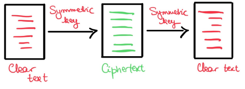

# Applied Cryptography and Network Security

## Definitions

- Privacy
  - Right to a private life
  - Be in control about information about yourself, to be left alone
  - Individual right + social value
- Security
  - Minimizing vulnerabilities of assets and resources
  - *Threat* is a potential violation of security
- CIA triad
  - *Confidentiality*: no unauthed disclosure of info
  - *Integrity*: no unauthed modification/destruction of info
  - *Availability*: resources accessible when required by authed user
- Threat
  - 2 types
    - Passive threat
      - Does not interact with system
      - Eavesdropping
      - Traffic analysis
    - Active threat
      - Attackers alter information in system
      - Masquerade: attacker claims to be different entity
      - Replay: attacker sends message which has already been sent
      - Modification of messages
      - DoS: attacker prevents legitimate users from accessing resource
- Security service
  - Service that gives a specific kind of protection
  - *Peer entity auth*: confirmation of claimed identity of an entity
  - *Data origin auth*: confirmation of origin of message
  - *Access control*: potection against unauthed use of resources
  - *Data confidentiality*: protects against unauthed disclosure
  - *Traffic flow confidentiality*: protects disclosure of data which can be derived from knowledge of traffic flows
  - *Data integrity*: detects modification, insertion, deletion or replay of data
  - *Non-repudiation*: protects against attempts of creator to falsely deny creating data
  - *Availability service*: protects against DoS
- Security mechanism
  - Method for implementing one or more security services
  - Encipherment (same as encyption I think)
  - Digital signature mechanisms
    - Transform data using signing key
  - OSI standard X.800 describes access control mechanisms and data integrity mechanisms
  - Authentication exchange mechanisms: ensure identity of protocol participants (e.g. TLS)
  - Traffic padding: protect against traffic analysis
  - Routing control mechanisms: use specific routes
  - The notarization mechanism: use trusted 3rd parties (notary) to assure source or receipt of data
  - 
- Risk management
  - Key tool for security management
  1. Identify threats
  2. Classify threats accoring to lokelihood and severity
  3. Apply security control based on cost benefit analysis

## Number theory, groups and finite fields

### Factorization

- $a$ divides $b$ if $a\cdot k = b, k\in \Z$
- Prime numbers
- How to test for primality?
  - Find out later
- Properties
  - if $a$ divides $b$ and $a$ divides $c$, then $a$ divides $b+c$
- Euclidean division
  - $a>b \implies \exists !(q, r), a=q\cdot b + r, r<b$
- Greatest common divisor (GCD)
  - Relatively prime if $GCD(a,b)=1$
- Euclidean algorithm
  - $GCD(a,b) = GCD(b, a\mod b)$
- Extended euclidean algorithm
  - FML
  - Back substitution
  - Solve equation $a\cdot x+b\cdot y = d$, ($a,b,d$ known variables, solve for integers $x,y$)

### Modular arithmetic

- Definition
  - You know the modulus operator
  - Be aware of calculation rules
- Residue class
  - Set $\{r_0, \dots, r_{n-1}\}$ is *complete set of residues* modulo $n$ of for every integer $a, a\mod n = r_i$ for exactly one $r_i$
  - Set $\{0, \dots, n-1\}$ form complete set of residues modulo $n$ since $a=q\cdot n+r, 0\leq r \leq n-1$
    - Denoted by $\Z_n$
    - $\Z_n^*$ is $\Z_n$ without 0

### Groups

- Set, $G$, with binary operation, $\cdot$, satisfying following conditions
  - Closure: $a\cdot b \in G \forall a,b\in G$
  - Identity: Exists element, $1$, such that $a\cdot 1 = 1\cdot a = a \forall a\in G$
  - Inverse: $\forall a \in G, \exists b\in G a\cdot b=1$
  - Assiciative: For all $a,b,c \in G, (a\cdot b)\cdot c = a\cdot (b\cdot c)$
  - Abelian groups are also commutative ($a\cdot b = b\cdot a \forall a,b\in G$)
- Cyclic groups
  - Order of group, $|G|$ = number of elements
  - Order of element $g\in G = |g|$, is smallest integer $k$ with $g^k\equiv_{|G|+1} 1$
  - Group element $g$ is a generator for $G$ if $|g|=|G|$
  - Group is cyclic if it has generator
  - Example:
    - Set:$\{0,1,2,3,4\}$
    - $|G|=5$
    - Generator is 2, since $2^k\mod 5$ creates the set for $k\in {1,2,3,4}$ (disregard the 0 in the set for multiplicative cyclic fields)
  - Cyclic group is always abelian, e.g. commutative
- Inverse modulo
- $ax\equiv_n 1$, $x$ is inverse of $a$
  - $a^{-1}\mod n$
- Has to be invserse if $gcd(a,n)=1$
- Use extended euclidean alg
  - $ax\equiv_n 1$
  - $a\cdot x+b\cdot y=1$
  - Find some value for $x$
- $\Z_p ^*$
  - Complete set of residues modulo a prime $p$ with 0 removed forms a group under multiplication
  - Properties
    - Order = $p-1$
    - Cyclic
    - Generally many generators
  - Can be represented as the multiplicative group $\{1,2,\dots p-1\}$
  - Finding generator of $\Z_p^*$
    - An element of order $p-1$
    - Lagrange theorem implies order of any element must exactly divide $p-1$
    - To find generator of $\Z_p^*$
      - Compute distinct prime factors of $p-1$, $f_1, f_2, \dots$
      - $g$ is generator as long as $g^{(p-1)/f_i}\neq 1 (\mod p)$ for $i=1,2,\dots$
  - Group of composite modulus, $\Z_n ^*$
    - For any $n$, we define $\>_n^*$ to be group of residues which have inverse under multiplication
    - Not cyclic in general
    - Finding order is difficult

### Fields

- Set, $F$, with binary operations $+$ and $\cdot$, satisfying following conditions
  - $+$ commutative: $a+b = b+a$
  - $F \backslash {0}$ commutative under $\cdot$
  - Distributive  for all $a,b,c\in F: a\cdot(b+c) = (a\cdot b)+(a\cdot c)$
- Finite fields
  - Only interested in fields of finite size
  - Only exists finite fields of size $p^n$, $p$ prime, $n$ int
  - Most interesting:
    - Field if size $p$
    - Field of size $2^n$
- Finite field $GF(p)$ (general field)
  - Often write $\Z_p$ instead of $GF(p)$
  - Multiplication and addition done in modulo $p$
  - Multiplicative group is exactly $\Z_p ^*$
  - Finite field $GF(2)$
    - Contains elements $\{0,1\}$
    - Addition is binary addition $\mod 2$
      - Same as logical XOR
    - Only 1 non-zero element gives trivial multiplicative group
    - Often use XOR, $\oplus$
- Finite field $GF(2^n)$
  - Arithmetic can be considered as polynomial arithmetic where field elements are polynomials with binary coefficients
  - Equate n-bit string to polynomial
    - $010011 = 0\cdot x^5 + 1\cdot x^4 + 0\cdot x^3 + 0\cdot x^2 + 1\cdot x^1 + 1\cdot x^0$
  - Field can be represented in different ways by use of primitive polynomial $m(x)$
  - Addition and multiplication defined by polynomial addition and multiplication $\mod m(x)$
  - Note: polynomial division easy by using shift registers
  - $GF(2^8)$ used for AES block cipher
  - To add two strings we add their coefficients modulo 2
  - Multiplication done with respect to generator polynomial which for AES is $m(x)=x^8+x^4+x^3+x+1$
  - Multiplying two strings is same as multiplying polynomials and taking $\mod m(x)$
- Boolean values
  - Boolean variable $x$ takes either value 0 or 1
  - Boolean function outputs boolean value

## Classical encryption

- Terminology
  - *Cryptography*: study of designing cryptosystems
  - *Cryptoanalysis*: Study of breaking cryptosystems
- Confidentiality and authentication
  - For confidentiality a key is needed to read the message
  - For authenticatino a key is needed to write the message
- Cryptosystems consists of the following:
  - Set of plaintexts
  - Set of ciphertexts
  - Set of keys
  - Function which transforms plaintext into ciphertext (encyption)
  - Function which transforms ciphertext into plaintext (decryption)
- Symmetric key encryption
  - Encryption and decryption key only known to sender and receiver
  - Requires secure channel for transmission of key
- Asymmetric key cipher
  - Each participant has public and private key
  - May allow for both encryption and digital signature
- Symmetric key encryption
  - 
- Public key encryption
  - 
- Digital signatures
  - 
- Notation for symmetric key encryption algs
  - $E$: Encryption function
  - $D$: Decryption function
  - $M$: Plaintext message
  - $C$: Ciphertext/cryptogram
  - $K$: Shared secret key
  - Encryption: $C = E(K,M)$
  - Decryption: $M = D(K,C)$

## Cryptoanalysis

- Considerations
  - What resources does the adversary have
  - What is the adversary's goal
- Methods
  - Exhaustive key search
    - Brute force
    - Attacker tries all possible keys
    - Minimum standard to have brute force be too computationally difficult
- Attack classification
  - **Ciphertext only attack:** attacker knowns only intercepted ciphertext
  - **Known plaintext attack:** attacker knows a small amount of plaintext and its ciphertext equivalent
  - **Chosen plaintext attack:** attacker can select plaintext and its ciphertext equivalent (inside encryptor)
  - **Chosen ciphertext attack:** attacker can obtain plaintext equivalent of some ciphertext (inside decryptor)
  - Modern standard is chosen plaintext/ciphertext should be secured against
- Kerckhoff's principle
  - The security of a cryptosystem must lie only in the choice of the key. Everything else must be assumed to be public knowledge

## Statistics of natural language

- We need to define alphabet of plaintext and ciphertext (usually same alphabet for the two)
- In our case, we use roman alphabet
  - $A=0, B=1, \dots, Z=25$
  - If space is included, it is numbered 26
- Real-world attacker needs to work out the alphabet
- Statistics for English
  - Statistics for the distribution of characters in English plaintext
  - Can be of both single-characeter, double-characters and truple-characters
- Basic cipher operations
  - Most ciphers based on a combination of two basic operations
  - *Transposition*: Mixing up characters in plaintext
  - *Substitution*: Replacing characters with other characters
- Transposition ciphers
  - Permutes characters usually in fixed period, $d$, and permutation, $f$
  - We can consider plaintext as matrix of rows of length $d$
  - Generally transposition ciphers can permute rows or columns
  - Cryptoanalysis
    - Frequency distribution same as for plaintext
    - Small period makes it possible to solve by hand using anagramming
    - Guess value of $d$ and write ciphertext in columns
    - Might optimise trials with knowledge of digram and trigram frequencies
    - Processes can be automated
- Simple substitution ciphers
  - Each character in aplhabet replaced by another character
  - Also called monoalphabetic substitution ciphers
  - Exampe Caesar cipher and random simple substitution cipher

### Caecar cipher

- Key: integer $j$
- For each letter with value $i$ in the alphabet, replace it with $(i+j)\mod n$, where $n$ is size of aplhabet
- Cryptoanalysis
  - Only need to find where one of the most frequent characters are shifted to

### Random simple subtitution cipher

- Replaces all similar characters in plaintext with another character
- E.g. all E become T, A become G, $\dots$
- Cryptoanalysis
  - Can still use frequency analysis
  - Tedious to do cryptoanalysis by hand
  - Better to use tools (like Cryptool)

### Polyalphabetic substitution

- Use multiple mappings from plaintext to ciphertext
- Makes it so that frequency analysis is no longer effective
- Given $d$ ciphertext alphabets $C_0, \dots, C_{d-1}$, let $f_i: A\rightarrow C_i$ be mapping from plaintext alphabet $A$ to $i$th ciphertext alphabet $C_i(0\leq i\leq d-1$
- Encryption process
  - Plaintext message $M=m_0m_1\dots m_{d-1}m_d\dots m_{2d-1}\dots$
  is enciphered to $E(K,M)=f_0(m_0)f_1(m_1)\dots f_{d-1}(m_{d-1})f_0(m_d)\dots$
  - $d=1$ gives monoalphabetic substitution
- Random polyalphabetic substitution cipher
  - Key generation
    - Select block length $d$
    - Generate $d$ random simple substitution tables
  - Encryption
    - Encrypt character $i$ (message index, not alphabet index), use substitution table $j$ where $i\equiv_d j$
  - Decryption
    - Use same substitution table as in encryption to reverse simple substitution
  - Example with $d=3$
    - 

### Vigenère cipher

- Key $K$ is specified by sequence of characters $K=k_0k_1\dots k_{d-1}$, where $k_i$ gives amount of shift on $i$th alphabet
  - $f_i(p)=(p+k_i)\mod n$, where p is plaintext character
  - Used to be widely believed to be unbreakable
- Cryptoanalysis
  - Identify period length
    - Kasiski method
    - Autocorrelation
    - Index of coincidence
  - Attack using $d$ different substitution tables
  - Identifying period using autocorrelation
    - Given ciphertext $C$ compute correlation between $C_i$ for all plausible values $i$ of the period
    - English is non-random, meaning there is better correlation between two texts of same size shift than between two texts with different size shifts
    - Therefore we expect to see peaks in value of $C_i$ when $i$ is a multiple of the period
    - Plotting result on histogram can allow us to identify period
    - Can be used to find period for any periodic polyalphabetic cipher
  - Example with Kasiski:
    - 
    - String PELPEK and WIKCIO occur multiple times
    - Positions of strings separated by 117 and 93 characters
    - Period is almost certainly common divisor for these 2 numbers $\implies$ period is either 1 or 3
    - Then attack using separate alphabets
    - From here on out it is like caesar cipher just multiple times

### Other polyalphabetic ciphers

- Autokey cipher
  - Starts off as Vignère, but once alphabet defined by key has been used once, uses plaintext to define subsequenct alphabets
  - Therefore not periodic
- Running key cipher
  - Uses practically infinite set of alphabets from shared key
- Rotor machines
  - Early 20th century electromagnatic machines were developed for encryption using rotors as moving alphabets
  - E.g. enigma machine during WW2
  - Each character encrypted using different alphabet. Enigma machine period of ~17000, in practice never repeating same message

## Hill cipher

- Performs linear transformation on $d$ plaintext characters to get $d$ ciphertext characters
- Multiplies block of plaintext, $P$ with $d\times d$ matrix $K$ to make cipher block $C$
  - If insufficcient letters we use padding with uncommon letter like Z
  - Multiplication is done modulo length of the alphabet
- Decryption is done by multiplying $C$ with $K^{-1}$
- Encryption: $C = K\cdot P$
- Decryption: $P = K^{-1}\cdot C$
- Note that matrices are made using numbers equal to the index of the letters (A=0, B=1, $\dots$)
- Example:
  - $d=2$
  - $K = \begin{pmatrix}
    4 & 5 \\
    1 & 7
  \end{pmatrix}$
  - $K^{-1} = \begin{pmatrix}
    15 & 19 \\
    9 & 16
  \end{pmatrix}$ (can be found by hand using Gauss elimination)
  - Encrypting digram BC = $\begin{pmatrix}
    1 \\ 2
  \end{pmatrix}$
  - $C = K\cdot P = \begin{pmatrix}
    4 & 5 \\
    1 & 7
  \end{pmatrix} \cdot \begin{pmatrix}
    1 \\ 2
  \end{pmatrix} = \begin{pmatrix}
    14 \\ 15
  \end{pmatrix} \rightarrow$ OP
- Cryptoanalysis
  - Known plaintext attack possible given $d$ plaintext-ciphertext matching blocks (and attacker knows $d$)
  - Suppose we are given column vectors $P_i, C_i, i=0,1,\dots, d-1$
  - $C=[C_0, C_1, \dots, C_{d-1}], P=[P_0, P_1, \dots, P_{d-1}]$
  - Solve $C=K\cdot P$ for $K$
  - $P = K^{-1}\cdot C$
  - Ciphertext only attacks are possible with added task of finding probable blocks of matching plaintext and ciphertext

## Stream ciphers

- Generation of keystream of any required length
- Each element in keystream used successively to encrypt one or more ciphertext characters
- Usually symmetric key ciphers
- Keystream must have good randomness properties
- Synchronous key ciphers
  - In simple kinds of stream cipher the key is generated independently of the plaintext
  - Both sender and receiver need to generate the same keystream
  - Vigenère cipher can be seen as periodic synchronous stream cipher
- Binary synchronous key cipher
  - For each time interval $t$, the following are defined
    - Binary sequence $s(t)$ called keystream
    - Binary plaintext $p(t)$
    - Binary ciphertext $c(t)$
  - Encryption: $c(t) = s(t) \oplus p(t)$
  - Decryption: $p(t) = s(t) \oplus c(t)$

## One time pad

- Key is truly random sequence of characters, all independently generated
- Each character in key is used one time only
- Provides perfect secrecy
  - Perfect secrecy achieved when $P(M_i | C_j) = P(M_i)$
  - In other words getting hold of the ciphertext does not make it easier to decipher the message
- Example in roman alphabet
  - Plaintext characters $p_1, \dots, p_r$
  - Ciphertext charcters $c_1, \dots, c_r$
  - Keystream: random characters $k_1, \dots, k_r$
  - Encryption: $c_i = (p_i + k_i)\mod 26$
  - Decryption: $p_i = (c_i - k_i)\mod 26$
- Even if ciphertext $C_j$ is observer, there is no way of telling which plaintext it originates from
- Vernam (binary) one time pad
  - Encryption: $c_i = k_i \oplus p_i$
  - Decryption: $p_i = k_i \oplus c_i$
- One time pad properties
  - Any cipher with perfect secrecy must have as many keys as there are messages
    - In this sense one time pad is only unbreakable cipher
  - Practical usage possible for pre-assigned communications between fixed parties
  - Main issue is how to deal with key management
  - Key generation, transportation, synchronization, destruction problematic due to long keys
  - In Caesar cipher, the key was one integer, now it is length of message
- Two-time pad
  - Cannot use same key twice!
  - $C_1 = K\oplus P_1$
  - $C_2 = K\oplus P_2$
  - Note for ciphertext only attack, $C_1$ and $C_2$ are known
  - Trick: $C_1 \oplus C_2 = K\oplus P_1 \oplus K\oplus P_2 = P_1 \oplus P_2$
  - We can get information about plaintext only from ciphertext!!!
- Visual cryptography
  - Splits image into to shares
  - Decryption by overlaying two shared images
  - Each share reveals no information about image
  - 

## Block ciphers

- Main bulk encryption algorithms
  - AES and DES widely employed
- Symmetric key ciphers in which each block of plaintext is encrypted with same key
- *Block* = set of plaintext symbols of a fixed size
  - Typically size between 64 and 256 bits
- Used in practice in configuration called modes of operation
- Notation going forward:
  - $P$: plaintext block of length $n$
  - $C$: ciphertext block of length $n$
  - $K$: key of length $k$
  - $C = E(P, K)$: encryption function
  - $P = D(C, K)$: decryption function
- Criteria for cipher block design
  - 2 important encryption techniques
  - *Confusion*: involves substitution to make relationship between key and ciphertext complex
  - *Diffusion*: involves transformations that dissipates statistical properties of plaintext across ciphertext

### Product cipher

- Cryptosystem in which encryption function is formed by applying or composing several sub-encryption functions
- E.g. we define multiple functions $f_1, f_2, \dots F_r$, that have keys $K_1, K_2, \dots K_r$
- $C = E(P, K) = f_r(f_{r-1}(\dots f_2(f_1(P, K_1), K_2)\dots K_{r-1}), K_r)$

### Iterated ciphers

- Special class of product ciphers
- Most modern block ciphers
- Encryption process divided into $r$ different *rounds*
- Sub-encryption functions are all the same function, $g$, called *round function*
- Each key $K_i$ is derived from the overall master key $K$
- $K_i$ are called *round keys* or *subkeys* and are derived from $K$ using a $key schedule$ process
- Encryption
  - $W_0 = P \newline
    W_1 = g(W_0, K_1) \newline
    W_2 = g(W_1, K_2) \newline
    \dots \newline
    C = W_r$
- Decryption
  - $W_r = C \newline
    W_{r-1} = g^{-1}(W_r, K_r) \newline
    W_{r-2} = g^{-1}(W_{r-1}, K_{r-1}) \newline
    \dots \newline
    P = W_0$
- Types of iterated ciphers
  - *Feistel ciphers*: e.g. Data Encryption Standard (DES)
  - *Substitution-permutation networks (SPNs)*: e.g. Advanced Encryption Standard (AES)

### Feistel cipher

- Iterated cipher in which the round function swaps the two halves of the block and forms new right hand half
- Sometimes called feistel network, since process can be seen as network in which two halves travel through
- Encryption
  - Split plaintext clock $P=W_0$ into two halves, $W_0 = (L_0, R_0)$
  - For each round, perform:
    $L_i = R_{i-1} \newline
    R_i = L_{i-1} \oplus f(R_{i-1}, K_i)$
  - $C = (L_r, R_r)$
  - 
- Decryption
  - Ciphertextblock $C=(L_r, R_r)$
  - For each of the $r$ rounds, perform:
    $L_{i-1} = R_i \oplus f(L_i, K_i) \newline
    R_{i-1} = L_i$
  - $P = (L_0, R_0)$
- Note that we never have to invert $f$, so any function works
- Still, choice of $f$ is critical, as it is the only non-linear part of the encryption

### Substitution-Permutation Networks (SPNs)

- Iterated network cipher
- Block length $n$ must allow each block to be split into $m$ sub-blocks of length $l$ such that $n=l\cdot m$
- 2 permutations defined
  - $\pi_S$ operates on sub-blocks of size $l$ bits:
    $\newline \pi_S: \{0,1\}' \rightarrow \{0,1\}'\newline$
    Called an S-box (substitution box)
  - $\pi_P$ swaps inputs from $\{1,\dots, n\}$, similarly to transposition cipher
    $\newline \pi_P: \{1,2,\dots, n\} \rightarrow \{1,2,\dots, n\}$
- Steps in SPN round function
  - Round key $K_i$ is XORd with current state block $W_i$
  - Each subblock is replaced by application of $\pi_S$
  - Whole block is permuted using $\pi_P$
  - 

### Standard security properties

- Avalanche effects
  - Good block ciphers exhibit avalanche effects with respect to both key and plaintext
  - *Plaintext avalanche*
    - Small change in plaintext should amount to large change in ciphertext
    - Ideally, changing one bit in plaintext changes half of the bits in the output block
    - Can relate to Shannon's notion of diffusion
  - *Key avalanche*
    - Small change in key should amount in large change in ciphertext
    - Can relate to Shannon's notion of confusion
- Differential cryptoanalysis
  - Powerful technique from the 90's
  - Chosen plaintext attack
  - Based on idea that difference between two input plaintexts can be correlated to difference between two output ciphertexts
- Linear cryptoanalysis
  - Known plaintext attack from 90's
  - Can theoretically break DES
  - Modern block ciphers typically immune to differential and linear cryptoanalysis

### Data Encryption Standard (DES)

- 1977: US standard for encryption
- Encryption and decryption definitions are public property
- Security resides in difficulty of encryption without knowledge of the key
- 16-round feistel cipher with key length = 56 bits, data block length = 64 bits
- Encryption
  - $P$: 64-bit input block
  - 64 bits of $P$ er permuted accordingly to an initially fixed permutation, denoted $IP$
  - 16 rounds of feistel operation applied, denoed by funcion $f$. Different 48-bit subkey used for each round
  - Final fixed inverse permutation, $IP^{-1}$ applied after 16 rounds, and result is ciphertext $C$
- DES feistel operation
  - Expand 32 bits to 48 bits
  - Bitwise XOR 48 bits to round subkey
  - Break 48 bits into 8 blocks of 6 bits each
  - Put block $i$ into substitution table $i$ outputting block with length 4 bits
  - Apply permutation to resulting 32 bits
  - 
- S-box example
  - 
  - Input block $B$ is $x_0x_1x_2x_3x_4x_5$
  - $x_0$ and $x_5$ define row number (0-3)
  - $x_1x_2x_3x_4$ define column number (0-15)
- Key schedule
  - Each of the 16 rounds involved 48 bits out of the 56 bit key
  - Each 48b subkey is defined by a series of permutations and shifts in full 56b key
- Brute force attack on DES
  - Testing all of the $2^k$ keys to find key $K$
  - Right key can be identified by using small number of ciphertext blocks, or looking for low entropy in decrypted plaintext
  - In DES there are $2^{56}$ keys to test, meaning it will take an average of $2^{55}$ trials to find the right key
  - As technology evolved, this became insecure
    - In 2007 a machine was built that can break 56-bit key in less than 1 week
- Double encryption
  - Principle: keys $K_1, K_2$, $C=E(E(P, K_1), K_2)$
  - Now requires $2^{2k-1}$ trials on average
  - Meet-in-the-middle method reduces time-memory trade off
    - Suppose we have ciphertext/plaintext pair $(P,C)$
    - For each key, store $C' = E(P,K)$ in memory
    - Check whether $D(C,K') = C'$ for any key $K'$
    - $K$ is $K_1$, and $K'$ is $K_2$
    - Check whether key values from previous step work for other $(P,C)$ pairs
    - Requires storage of one plaintext block for every possible key
    - Expensive, but much easier than computing $2^{111}$ keys
- Triple encryption
  - Provides much better encryption
  - Three keys $K_1, K_2, K_3$
  - Encryption defined by $C=E(D(E(P, K_1), K_2), K_3)$
  - Secure from meet-in-the-middle attack
    - If $E has strong pseudo-random properties, so does D=E^{-1}$
- Standardised options
  - 1999 version of DES specified 3 options
    - Use 3 independent keys (most secure)
    - $K_1 = K_3$ (secure enough)
    - $K_1=K_2=K_3$ (backward compatible with single DES, vulnerable)
  - From 2019:
    - 2-key DES only allowed for legacy purposes
    - 3-key DES allowed in existing applications only, from 2023 legacy only

### Advanced Encryption Standard (AES)

- AES designed in open competition due to controversy over DES
- Algorithm
  - Symmetric key block cipher
  - 128b data block
  - 128b, 192b or 256b master key
  - 10, 12 or 14 rounds (depending on master key size, I think)
  - Byte based design
  - Essentially substitution-permutation network
  - Mixture of field operations in $GF(2^8)$ and bit string operations
- Round transformations
  - 4 basic operations:
    - ByteSub (non-linear substitution)
    - ShiftRow (Permutation)
    - MixColumn (Diffusion)
    - AddRoundKey
  - Essentially substitution-permutation network with $n=128, l=8$
  - S-box is look-up table but mathematically defined in $GF(2^8)$
  - See slides for example
- Key schedule
  - Each round uses 128b subkey
  - Number of subkeys required is one for each round plus an initial subkey
    - 128b key means 11 subkeys required
  - Key schedule derives 11 128b subkeys from 128b master key
- AES security
  - Some cracks have appeared, but no breaks
  - Attacks exist on reduced-round versions
  - *Related-key attack* exists. Require attacker to obtain ciphertext encrypted with a key related to actual key in some way
  - Most serious real attacks reduce effective key size by around 2 bits
- Comparison to DES
  - Block size
    - DES - 64b
    - AES - 128b
  - Key size
    - DES - 56b
    - AES - 128, 193 or 256b
  - Design structure
    - Both iterated ciphers
    - DES feistel structure, AES SPN
    - DES bit-based, AES byte-based
    - AES significally faster in both hardware and software