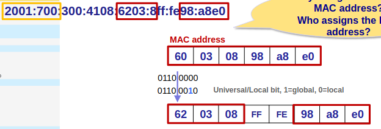
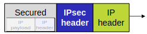

# Applied networks

## Internet architecture

- Network of networks
- Access network $\rightarrow$ regional network $\rightarrow$ core network $\rightarrow$ regional $\dots$
- People connect their home network to the internet through ISP networks
- ISP networks connected through IXP (Internet exchange point)
- Also possible to have peering links, that connect ISP networks without going through IXP
- Tiers of ISP
  - As many tiers as we want
  - Providers send from tier $N$ to customer at tier $N+1$
  - Can also connect to Content Delivery Service (CDS)
  - Look through more
- Routers interconnect various network technologies
- Network structure in 2d
  - Access networks/points
    - Connects users
  - Network edge
    - Application on end systems/hosts
  - Network core
    - Network of networks
  - Routers
    - Interconnect routers
    - Forward packets
  - Packets
    - Chunks of data
- Internet protocol layer
  - App (message)
  - Transport (segment)
  - Network (packet/datagram)
  - Link (frame)
  - Physical (bit)
- Network neutrality
  - Principle contributing to everyone's ability to use the Internet with equal conditions
  - Implemented in common European ruleset
- Internet in 3D (protocol layer)
  - Network edge devices read all layers
  - Switches read physical and link layer
  - Routes read physical, link and network layer
- Service models
  - Service model of a layer is services it offers to the above layers
- Performance parameters
  - Quantifiable Quality of Service (QQoS)
  - Throughput
    - Experienced speed
    - Rate at which bits are transferred between sender and receiver
    - Capacity
      - Maximum possible throughput
  - Delay
    - Measured by looking at Round trip time (RTT)
    - 4 sources
    - Nodal processing
    - Queuing
    - Transmission (packet length / link bandwidth)
    - Propagation (length of physical link / propagation speed)
  - Packet loss
    - Packet arrives to full queue
    - Retransmission
  - What does it tell us?
    - Download throughput
    - Upload throughput
    - Round-trip time
- Internet approach bottom up
  - Transmission of bits
  - Bits are *framed* and transmitted over link which is point-to-point or broadcast, using MAC addr
  - Frame transports *IP datagram* one hop towards its destination
  - IP datagram contains IP addresses of sender and receiver
  - Routers forward IP datagrams hop by hop using forwarding tables built by routing protocols
  - Provided IP service is connectionless, best-effort service
  - End-end transport layer adds error and flow control and congestion control
  - Domain Name System translates between names and IP addresses
  - Distributed applications run only in end systems and exchange data accross network

## IP addressing

- IP addresses
  - Consists of 2 parts
  - Network part
  - Interface part
  - Size of parts can vary
  - Interface
    - Connection between host/router and physical link
    - Routers typically multiple interfaces
    - Hosts typically one active interface
  - Link-local address
    - Interface chooses own IP address
    - Used when not DHCP in router
- Subnetting
  - IP addess: subnet part + host part
  - Subnets
    - Can physically reach each other without intervening router
    - Device interfaces with same subnet part of IP address
    - Subnet mask (/n) define use of address space
    - To determine subnets, detach each interface with its host or router, and count islands
  - One IP address for broadcast (host = 1s), and one for network address (host = 0s)
  - IP address divided in 3:
    - Address from ISP
    - Subnet
    - Interface
    - (address + subnet = network part)
- IPv6
  - 128 bits
  - 8 groups of 4 hex ciphers
  - $\text{x:x:x:x:x:x:x:x}$ (x is 2 bytes)
  - /32 subnet is smallest IPv6 assignment an end user might receive with current policy
  - E.g. end user will be assigned $2^{32} \approx 4\cdot 10^9$ IPv6 addresses
  - End user assigned smalles IPv6 assignment gets a single IPv4 address
  - Notation
    - Leading 0 suppression
      - If first hex in a cipher is 0, it can be removed (at least 1 cipher in total)
      - 00FF can be rewritten as FF
    - Zero compression
      - Contiguous series of cipher blocks set to 0 can be replaced with ::
      - Can only be applied once per IP address to avoid ambiguity
      - E.g. FE80:0:0:0:2AA:FF:FE9A:4CA2 can be compressed to  FE80::2AA:FF:FE9A:4CA2
  - Link-local unicast start with FE80::\<interface part>
  - Network interface card MAC address
    - Interface MAC address embedded in IPv6 address
      - 
      - FFFE placed in the middle of MAC address
      - bit 7 special
        - =1, means global, =0 means local
        - If MAC address has bit 7 = 0, it is set to 1 in global network
    - Bad because MAC address should be kept private

## Internet end-end

- Instance: browser loading page from google.com

1. Laptop connecting to net work gets IP address, address of first hop router, address of DNS server using DHCP
   - Dynamic Host Configuration Protocol (DHCP)
     - Client broadcasts DHCP messages on local subnet using IP
     - Dyncamically gets IP address of client, first-hop router, DNS etc.
     - DHCP relays forwards message to DHCP server
2. Before sending HTTP request, IP address of google.com is resolved using DNS
   - Address Reslution Protocol (ARP) finds mapping between IP and MAC addr within LAN
   - ARP request broadcasted
   - Nodes create their ARP tables without intervention from net administrator
   - [IP addr, MAC addr, TTL]
3. To get MAC address of first-hop router, laptop uses ARP
4. Laptop sends DNS query using UDP
   - Domain Name System (DNS) translates between names and IP addresses
5. Routers forward IP packets
6. DNS server replies with IP address of google.com
7. To download page from google.com, TCP is used to set up connection
   - Transmission Control Protocol (TCP) delivers reliable byte stream
   - Point-to-point full duplex
     - One sender, one receiver
   - Connection-oriented
     - Handshake initialization
   - Error control
     - Bit error, segment error
   - Flow control
     - Sender will not overwhelm receiver
   - Congestion control
     - Sender adjusts transmission depending on network load
   - Port numbers used for demultiplexing to relevant application processes
8. Laptop can then send HTTP request
9. Server returns default page at google.com using HTTP response

- Instanse: email sent from one email client to another
  - Do research

## Router architecture

- Function, not necessarily router component

### Tunnelling

- Many cases
- Interconnect IPv6 routers over IPv4 routers
  - Encapsulate IPv6 packet inside IPv4 packet
- Virtual Private Network (VPN)
  - Similar to IPv6 tunnelling, just also putting IPsec inside of IPv6 header
  - Uses tunnelling protocols and security procedures
    - Other tunnelling protocols than IPsec
    - Protocols in different layers
  - Virtual
    - Connectivity deployed on shared infrastructure
    - Reduces cost of separate routers, links, etc.
  - Private
    - Network looks private to user with same policies and performance as private network
    - Possibly encrypted before entering public internet
  - IPsec VPN is layer 3 protocol which encrypts original IP packet before entering public internet
    - 
  - Maintains privacy
  - Secure link over public internet
  - Site-to-site VPN
    - Tunnel from VPN gateway to other VPN gateway
    - No VPN client (client no knowledge of VPN)
    - Layer 3 protocol
  - Remote access
    - SSL VPN tunnell from computer to SSL VPN HQ
    - SSL is transport layer protocol

### Performance parameter

- Throughput
  - *Line speed*: maximum amount of data capable of transmitting across communication line
  - Router with throughput 1Gbps, 10 (even) ports, means line speed is 100Mbps (given certain conditions)
- Delay
  - Queuing delay important
- Packet loss

### Router internals

- Router consists of 4 different parts
  - Input port
  - Switching fabric
  - Output port
  - Processor
- Input port
  - Line termination, link layer protocol, lookup, forwarding, queuing in buffer
- Output port
  - Buffering, scheduling, link layer protocol, line termination
- Switching fabric
  - Transfer packets from input to output buffer
  - Multiple ways to implement
    - Memory
    - Bus
    - Interconnection network
- Routing Information Base (RIB)
  - Global view of network
  - Overview of topology
  - Knows which router is connected to which
  - Requires destination subset, cost for hop, and more
  - Uses Routing Protocol
    - Do more research!
    - RIB + Routing protocol = 2 main control plane components
- Forwarding Information Base (FIB)
  - Local forwarding decision
- Process of router
  - Packet reaches front of queue
  - Ready to be transmitted to output port
  - Might not be possible, due to multiple reasons
    - Queue in output port
    - Output port might be bottlenecked by switch connected to output port
- Control plane
  - Controlled by processor
  - Which output port to send incoming packet?
  - Forwarding Information Base (FIB) computed
    - This is the forwarding table
    - Computed using OSPF and BGP (more protocols, but we focus on these)
- Memory in router
  - Need faster than RAM
  - Not use adressed memory, which is too slow
  - Content-Addressable Memory (CAM)
    - Used in switches and routers for exact matches
  - Ternary CAM (TCAM)
    - Used in routers for longest prefix matches

## Intra-domain and inter-domain routing

- Intra-domain vs inter-domain
  - Intra = within one
  - Inter = between multiple
  - Domain = collection of interconnected devices and network objects
- Open Shortest Path First (OSPF) used for intra-domain routing
- (Mainly) BGP used for inter-domain
- Link State vs Distance Vector
- Autonomous systems on internet (?)
  - Has ID
- Intra-domain routing protocol build routing tables
  - Table consist of [Destination, next hop] pairs
    - See slides for picture
  - Routing protocols rub netween routers to maintain correct picture of network topology
  - Shortest path found through distributed and dynamic routing algorithms
  - Route summarization reduces size of routing table
  - Many ways to view cost in a link
    - Length
    - Bandwisth
    - Delay
    - Packet loss
    - More
- Choice of routing protocol
  - Depends on network complexity, size, policies
  - Scalability
  - Stabiliy during outages
  - Speed of convergence
  - Metrics
  - Can use distance vector or link state
  - Distance vector
    - Route Information Protocol (RIP)
    - Bellman-ford
    - Do research
  - Link state
    - OSPF
    - Dijkstra
    - Tell everyone what you know about your neighbours
      - Each ndoe sends all nodes information on state of directly connected links
      - Global: all routers have complete topology
- Link cost
  - Abstraction, but highly relevant
  - Inversely related to bandwidth
  - Inversely related to congestion
  - OSPF cost metric is 16 bits long
    - Max cost 65535
  - $c(x,y)$ = cost of link $(x,y)$
    - Basic unit is 100Mbps
  - Cost = reference-bandwidth[bps]/interface-bandwidth[bps]
    - Same reference bandwidth for all routers in OSPF domain
    - Default reference-bandwidth = $10^8$ bps
  - See slides for more conventions
    - For instance use $\frac{1}{\sqrt{bandwidth}}$ (i think)

### Open Shortest Path First (OSPF)

- Link state
- Dijkstra
- For larger networks, shortest path first algorithms will consume more memory and CPU resources
- Add additional hierarchy Area
  - Shortest Path First computed within area
- Areas scale OSPF to support large networks and reduce
  - Link state DB size
  - CPU processing
  - Number of link state updates
- *Backbone area*: all other areas connected to it
- *Stub areas*
  - External routes not communicated
  - Prevent propagation of external routes to reduce DB size
  - Reduces size of link state
- As a routing protocol
  - Two-layer hierarchy
    - Traffic between non-backbone areas must pass through the backbone area
  - All routers within OSPF area have synchronized link-state information in OSPF link-state DB
    - Areas have area ID of 32 bits
    - Backbone area has address 0
    - Router in area stores topological information for
      - State of all links in area
      - Summary links describing IP networks in other areas
      - External links describing IP networks in other networks
  - Classless routing protocol: supports variable-length subnet masking (VLSM) and discontinuous networks
  - Uses muticasting and unicast for sending messages
  - Supports auth
  - Runs on top of IP (protocol nr 89)
- Router types
  - Internal-area routers (IA)
    - Interfaces only within one area
    - Exchange routing info withon OSPF area
    - Holds topological information on
      - State of all intra-area links
      - Summary links of IP networks in other areas
      - External networks or default routes
  - Backbone routers
    - Interface in area 0
    - Complete topological DB for network
      - State of backbone links
      - Summary links for IP in other areas
      - External links that describe external IP networks
  - Area border routers (ABR)
    - Interface in two or mrore areas of which one is area 0
    - OSPF process per area
    - Virtual links
    - Topology information
      - Per connected area
      - Summarized routes per area
      - External routes
  - Autonomous System boundary/border routers (ASBR)
    - Exchange readability information with other domains
      - E.g. OSPF, RIP, BGP
    - Import external routes into OSPF
    - Every router knows parh to ASBRs
- OSPF internal routes
  - Intra-area route
    - Route to destination in same area
  - Inter-area route
    - Route to destination in another area
  - OSPF route summarization
    - Keeps routing tables smaller
    - On any bit boundary (variable subnet mask)
      - See slide 23
    - IP addresses carefully assigned
      - Enough addresses to allow expansion
      - Set bit boundary on which to summarize routes
- OSPF external routes
  - End-end paths consisting of
    - External portion with cost assigned by ASBR
    - Internal portion with cost calculated using OSPF standard algorithm
  - External route type 1: cost is sum of internal and external cost
  - External route type 2: cost ignores OSPF internal cost
  - External route summary
    - Performed by ASBR
    - Applies to external routes injected into OSPF network
- Stub areas
  - Routers don't maintain information about external networks
  - No direct connection to external network
  - ABR generate default external routes into stub area
  - Stub area router = topological database
    - State of all local links
    - Summary links describe IP networks in other areas
    - Default external route
- Not So Stubby Area (NSSA)
  - Is a stub area
  - Can import AS external routes through ASBR within the area
- Totally Stubby Area
  - All inter-area and external traffic matched to default route announced by ABR
  - Routers hold database that describes
    - State of all local links only
    - Default route
- How does OSPF work
  - Routers must discover each other
  - Routers update each other for consistent link-state databases
  - Each router computes shortest path to every network in its link-state DB using Dijkstra
- OSPF adjacency
  - Adjacency must be established in different OSPF network types
    - Broadcast networks
      - Most used
      - OSPF DR and OSPF BDR selection
    - Point-to-point networks
      - One to one connections
      - No OSPF DR and BDR selection
    - Non-broadcast multiple access (NBMA)
      - All transmission is unicast
      - OSPF DR and BDR selection
    - Point-to-multipoint networks
      - Point to point links, but OSPF packets work with multicast
      - No OSPF DR and BDR selection
  - Designated router (DR) reduces OSPF traffic on broadcast networks
    - Exchange of topological database with every router would require $\frac{n(n-1)}{2}$ adjacencies in broadcast network
    - Each router establishes adjacency with DR or backup DR (BDR)
    - Routers only synchronize with DR/BDR
  - Establishing adjacency
    - Routers generate OSPF hello packets on every interface
      - Sent to multicast address 224.0.0.5
    - OSPF hello protocol elects
      - DR: highest OSPF interface priority
      - BDR: second highest OSPF interface priority
      - If there is a tie, largest router ID breaks the tie
  - Initial link state DB sync - exchanging Link State Advertisement (LSA)
    - Hello protocol
      - Neighbor discovery
      - DR/BDR election
    - DB exchange
      - Exchange Database Description (DD) packets
      - Master=highest Router ID may retransmit DD packets
    - Database loading
      - Request missing/more current LSAs
    - See slide 36 for more info
  - LSA = messages sent to announce changes in network
- Routers exchange LSA in OSPF packets to maintain consistent link-state DB
  - LSA
    - Link characteristics: IP address, subnet mask, cost, operational status
    - Route summarization
  - Common LSA types
    - Type 1 router LSA
      - Generated by each OSPF router for each of its areas
      - Describes advertisers router's directly connected links
      - Flooded within area
    - Type 2 network LSA
      - Generated by DR
      - Describes broadcast/NBMA networks and their attached routers
      - Flooded within area
    - Type 3 summary LSA
      - Generated by ABR
      - Describes routes to networks in other areas within OSPF network
      - Flooded to routers in all non-local OSPF areas except Totally Stubby Areas
    - Type 4 ASBR summary LSA
      - Originated by ABR
      - Describes route to ASBR
      - Flooded through OSPF network (except stub areas)
    - Type 5 ASBR external LSA
      - Originates in ASBR
      - Describe routes external to OSPF network
      - Flooded through OSPF areas network (except stub areas)
    - Type 7 NSSA external LSA
      - Describes routes external to OSPF network
      - Flooded only within NSSA
  - LSAs flooded to entire area by OSPF Link State Update packets sent directly over IP
  - LSA flooding on broadcast networks
    - OSPF packets originates from DR or BDR using multicast address 224.0.0.5
    - Non-DR/BDR routes send link state update and link state ack packets using multicast address 224.0.0.6
- OSPF packet type
  - Common OSPF header for all 5 types of message
    - Encapsulated in IP
      - Protocol field = 89
      - Multicast address on broadcast and p-p networks (225.0.0.5 for all OSPF routers)
      - Unicast address on non-broadcast networks
    - **Version**
    - **Type** of OSPF packet
    - **Packet length** including header
    - **Router ID** of one of router's interfaces
    - **Area ID** of interface on which packet is being sent
    - **Checksum** of entire packet
    - **Auth type**
      - 0 = no auth
      - 1 = simple password
      - 2 = MD5 checksum
  - Messages
    - Hello (type=1)
      - Discover neighbors and build adjacencies
    - Database Description (type=2)
      - LSA headers for DB sync between routers
    - Link State Request (type=3)
      - Request specific LSAs
    - Link State Update (type=4)
      - LSAs sent as response to LS request, on link change and every 30 min, using flooding
    - Link State Ack (type=5)
      - Acks LS update packet types - reliable flooding
  - Packet type 1: hello packet
    - **Network mask** of interface on which hello packet is being sent
    - **Hello interval**: must be same for all routers attached to common network
    - **Options**: capabilities a router may or may not support
    - **Router priority**: router with higher priority takes precedence in DR election
    - **Router dead-interval**: no packet received for ded-interval duration, neighbor is dead
    - **DR address** (interface IP address)
    - **BDR address** (interface IP address)
    - **Neighbor IDs**: list of neighbor routers from which router has received hellos within dead-interval
  - Packet type 2: DD packet
    - DD header (in addition to OSPF header)
      - **Interface MTU** (maximum transmission unit)
      - **I/M/MS bits**: initial-bit, more-bit, master/slave bit
      - **DD sequence number**
    - LSA header
      - **Link State Age**: seconds since origination
      - **Link state ID** depends on LS type (see slides)
      - **Advertising router**: router ID of originator
      - **LS seq number** helps identify most recent LSA
  - Packet type 3 & 4
    - Database exchange: LS request/update
    - If no match in local DB for LSA headers in received DD packets then request complete LSA using LS req packet
    - LS request
      - **LS type**
      - **LS ID**
      - **Advertising router**
      - Uniquely defines LSA, but not its instance
    - LS update issued
      - In reponse to LS request
      - When change in link state
      - Every 30 mins
    - LS update
      - **Number of advertisements**
  - Link state DB in each node build from flooding LSAs
    - E.g. router LSA, network LSA
- OSPF in operations
  - When adding new router, network engineer must answer following questions
    - What type of router will the router be (AR, stub router, ABR)?
    - If the router is ABR or ASBR, what routes will it summarize?
    - What impact would the failure of the router have for OSPF routing?
    - Will the router be DR/DBR?
    - How will the router affect the performance of other OSPF routers?
  - OSPF maintains link-state DB that requires sizeable memory
  - If size of topology grows out of bounds, shortest path first may hog CPU resources
  - OSPF assumes hierarchical network topology
  - To reduce size of link-state database an area may be split
- See slide 52 for useful  summary of OSPF
- Research:
  - RIP and ISIS
  - Stub areas, NSSR, TSA
    - Internal routes, inter-area routes, external routes

### Border Gateway Protocol (BGP)

- Inter-domain protocol
- Linking entities
- Interconnection of ISPs on different tiers
  - Remember tier 1 (large region, continent), tier 2 (multi-country), tier 3 (city) ISPs
  - ISPs talking through routers using BGP
- Number of hops
  - Can be number of routers (not switches)
  - Can also be numbers of Autonomous Systems (shortest AS-path)
    - Not interesting how many routers are in each AS
  - Preferable to have this smallest number of hops
- Multi-homing
  - Tier 3 network connected to multiple tier 2 ISPs
  - Failover-protection in case one tier-2 router fails
  - Normal for router ports to fail
- Interconnection
  - Private peering
    - Directly p2p link
    - Reduce payments to provider ISP
  - Public peering
    - Internet Exchange Point (IXP)
    - Physical infrastructure that allow different ISPs to exchange routes and traffic between ASs using mutual peering agreements
    - Reduce ISP dependency on upstream provider
    - Increase efficiency
    - 6 IXPs in Norway
- Intra- vs inter-domain routing protocol metrics
  - Intra-domain routing rely on single composite metric to choose best destination
    - OSPF uses inverse of bandwidth
    - RIP uses hop count
    - BGP uses path vector with shortest number of AS hops
      - Attributes describe path in various ways, allowing network admins to implement various routing policies to select a single best path to each destination
      - See slides for how path vector is implemented in ASs
      - Not the only policy (10 selection criteria)
        - E.g. also Local Preference and Multi-Exit Discriminator (MED)
- BGP operation
  - Port 179
  - Start BGP on router using AS number on local router
    - Manually configure neighbors
  - Neighbor advertises routes
    - BGP peers exchange full BGP routing tables initially
  - After full exchange, only incremental updates are sent
  - After establishing BGP sessions, routers exchange keepalives
    - Tells neighbors router is still available
    - Tells that there are no changes (if no additional update message)
    - No updates within HoldTime implies to neighbors router is erased and session is closed
- Exterior BGP (eBGP)
  - Across AS boundaries
  - Exchange prefixes with other ASes
- Interior BGP (iBGP)
  - Between BGP nodes within AS
  - Redistribute AS border routes reaches specific address
- Manipulating path selection (AS-PATH prepending)
  - Adding end destination AS number multiple times to increase vector length
    - (AS1, AS2, AS2, AS2, AS2)
- BGP uses attribute types to describe advertised prefix

## Network layer control

### Software Defined Networking (SDN)

- Traditional routing algorithms use per-router control plane
  - Computing forwarding table by exchanging routing messages accoring to routing protocol
  - Everything on single device
  - Also needs configuration do be done on every single device
    - Pain
  - Mostly still this way today
- SDN control plane
  - Provides more flexibility
  - Control plane controlled from central area
  - SDN controller computes and installs forwarding table in switches/routers
    - Makes it possible to use layer 2 devices as routers
  - Routers no longer need computing capability
  - More ports per device
  - Control layer communicates with Control Agents (CA), which lies in data plane
    - Southbound API
  - Control plane interacts with app layer
    - Northbound API
  - Protocols for communication between routers and control plane
    - E.g. openflow
  - Flow table rather than forwarding table
  - Issues
    - Single point of failure (control layer)
    - Therefore still not widely deployed, especially in larger areas
    - Data centers might use SDNs
  - Two types of architecture for SDN controllers
    - High Availability (HA)
    - Fault Tolerant (FT)
- Openflow
  - Openflow controller runs control plane and programs switch
  - Implemented on a separate HW device
  - Protocol defines:
    - Device state and behaviour
    - Communication messages and their formats
    - Unencrypted TCP connections defined within a data center
    - Encrypted over the internet (secure channel)
  - One controller can program multiple packet switches in data plane
  - Defines 3 things
    - Switch state
      - What can software configure to match packets and how is it represented?
      - Physical ports and virtual ports
    - Switch behaviour
      - Given a state, how shall switch forward or modify packets?
      - Match-and-action
    - Communication with controller
      - How shall changes to switch state be described?
- Data plan flow focus
  - Packet-switch (layer 3 and/or layer 2 switches)
  - Flow: packets defined by header fields
    - E.g. ethernet, VLAN, IP, TCP/UDP port pairs
    - Unidirectional
  - Flow entries in flow tables
    - Represent flow in devices
    - First header field match selected
    - Counters: flow statistics
    - Action performed: drop, forward, modify matched packet and send to controller
    - Computed, installed, updated by remote controller
    - Defins router's general forwarding math+action rules
  - In-band signalling
    - Do research
  - Out-of-band signalling
    - Control plane traffic separated from data plane traffic
- Software-defined WAN (SD-WAN)
  - Centralized traffic engineering (TE) dynamically optimize site-to-site pathing
- See slides for SDN summary

### Network management

- Traditional networks
  - Control software runs independently in each device
  - SNMP and netconf found in *management layer*
- Components of network management
  - Managing server
  - Network management protocol
    - Used by managing serve to query, configure, manage device
    - Used by devices to inform managing server of data, events
  - Managed device
    - Equipment with manageable, configurable hardware, software components
  - Data
    - Device "state" config data, operational data, device statistics
- Network operator approaches to management
  - Command Line Interface (CLI)
    - Operator issues direct to individual devices
  - SNMP/MIB
    - Operator queries/sets device data
  - Netconf/Yang
    - More abstract, network-wide, holistic
    - Emphasis on multi-device config management
    - Netconf: communicate yang-compatible actions/data to/from/among remote devices
    - Yang: data modelling language
- Simple Network Management Protocol (SNMP)
  - Simple protocol for network management
  - Application layer protocol
    - Uses UDP
  - Message types
    - GetRequest: manager-to-agent - "get me data"
    - GetNextRequest: same as above
    - GetBulkRequest: same as above
    - SetRequest: manager-to-agent - set MIB value
    - Response: agent-to-manager - value, response to request
    - Trap: agent-to-manager: inform about exceptional event
  - Challenges
    - Simple protocol, leaving hard work to developers
    - SET requests sent independently. Might cause seriour error if multiple set requests sent at once to one device, and one fails
    - SNMP does not include mechanism to undo recent changes in device config
    - SNMP does not provide sync among multiple devices. If manager sends SET request to group of devices, it is possible only some arrive
    - SNMP does not employ standard security mechanisms. Security is self-contained within the protocol, making credentials and key management complex and difficult to integrate with existing credential and key management systems
- Network configuration protocol (NETCONF)
  - Manage/configure devices network-wide
  - Defines operations for managing network devices where config data can be retrieved, uploaded, manipulated and deleted
  - Modifies several parameters in single operation
  - Operation between managing server and managed network devices
    - Actions: retrieve, set, modify, activate configurations
    - Atomic-commit actions over multiple devices
    - Query operational data and statistics
    - Subscribe to notifications from devices
  - Remote Procedure Call (RPC) paradigm
    - NETCONF protocol messages encoded in XML
    - Exchanged over secure, reliable transport protocol (e.g. TLS)
  - Some NETCONF operations
    - *Get-config*: retrieve all or part of given config. A device might have multiple configs
    - *Get*: retrieve all or parts of both configuration state and operational state data
    - *Edit-config*: change specified configurations at managed device. Managed device \<rpc-reply\> contains \<ok\> or \<rpcerror\> with rollback
    - *Lock/unlock*: lock config datastore at managed device, to lock out CLI, netwonf, SNMP commands from other sources
    - *Create-subscription*, *notification*: enable event notification subscription from managed device
- Yet Another Next Generation (YANG)
  - Data modelling language used to specify structure, syntax, semantics of netconf network management data
  - NETCONF communicated YANG-compatible actions and data to/from/among remote devices
  - XML document describing device and capabilities can be generated from YANG description
  - Contraint among data that must be satisfied by a valid NETCONF configuration
    - Ensure NETCONF configurations satisfies correctness, consistency

### Broadcast and multicast routing

- Unicast
  - One to one
  - Routing uses shortest path from source to receiver
- Broadcast
  - One to all
  - Example DHCP to get network config data
    - Send discover packet to either DHCP server or relay (which is connected to server over other networks)
  - Both MAC and IP set to all 1s
  - Example ARP
    - All 1s is also broadcast MAC address
  - For network-wide broadcast layer-3 mechanism needed
  - Source duplication
    - Replicated unicast
    - Separate copy of packet sent to each destination
    - Recipients and their addresses must be known to sender
    - Relies on unicast routing
  - In-network duplication
    - Packet duplicate created by network nodes
    - Network nodes send to all nodes except the one it was received from (uncontrolled flooding)
    - Causes *endless cycling* if there are cycles
    - *Broadcast storm*: endless multiplication of packets
    - Flooding must be controlled
      - Instead use multicast to everyone (?)
      - Router checks if it has already received the packet
- Multicast
  - One to many
  - Network layer provides service to send from one to many
  - Multicast routing allows source to send packet to subset of network nodes
  - Source transmits only one copy of packet
  - Examples
    - Software upgrade
    - Streaming
  - Why?
    - Better utilization of server, routers, bandwidth
    - Concurrency delivery
    - Simplified administration
  - Receivers of multicast group must be identified
  - Controlled flooding
    - Minimize cost from receivers to source as opposed to source to destination in unicasting
    - Packets only flooded if arrived on shortest path back to source
      - Reverse path forwarding/broadcast (RPF/RFB)
        - If datagram received on interface with shortest path to source: forward to all interfaces except incoming
        - Else drop datagram
        - See slides for illustration
      - Source-specific tree
        - Nodes only need to know next neighbor on shortest path to the source
          - Based on unicast routing table
      - E.g. Protocol Independent Multicast (PIM) Dense Mode
    - No forwarding of packet duplicates
      - Sequence-number controlled flooding
        - Sequence number and source address/ID in packets
        - Drop packet if it is duplicate of previously received packet
        - E.g. OSPF
      - Spanning-tree
        - Nodes do not receive duplicates
        - Shared tree
          - Nodes use same spanning tree
          - Only need to know its neighbors in the tree
          - E.g. spanning tree algorithm
          - E.g. PIM sparse mode
        - Source-specific tree
          - Spanning tree per source
          - E.g. PIM dense mode
        - Shortest spanning tree vs minimum cost tree
          - SS: shortest path from source to each individual receiver
          - MC: lowest total cost
          - These are graph theory concepts, and are correlated to shared- and source-specific trees
  - Elements in multicast routing architecture
    - How to discover sources and receivers
    - Building/maintaining distribution trees between source and receivers
      - Unicast vs multicast routing protocol
      - Unidirectional vs bidirectional
      - Flooding vs explicit join
      - Hard vs soft state
      - Intra- vs inter-dimain
    - Multicast group administration
      - Join and leave: delivery without source knowing receivers
  - Internet Group Message Protocol (IGMP)
    - Common multicast protocol
      - Alongside multicast OSPF and multicast BGP and more
    - Multicast group members - group identification
      - Multicast destination is addressed using address indirection
        - Single identifier used for group of receivers
        - Packet delivered to all addresses associated with group
      - Multicast address defines a session (independent of users unicast address)
      - IPv4 multicast group of receivers is a class D multicast IP address
        - First hex is 0b1110 (look into, 0xD=0b1101)
        - Addresses from 224.0.0.0 to 239.255.255.255
      - IPv6 multicast address block FF00::/8
      - There are well-known multicast address allocations (see slides)
        - IGMP/MLD = 224.0.0.22
        - PIM = 224.0.0.13
      - Packet sent to multicast group always has unicast source address
        - Source can never be multicast address
  - Source and receivers in multicast groups
    - Multicast address used for group of receivers
      - Independent of receivers unicast address
      - Identifies channel/content, not destination
    - Source and receiver have home router supporting multicast
    - Multicast session identified by *(s, M) =(source, Multicast group)*
      - *(\*, M)*: shared tree
      - *(s, M)*: source-specific tree
  - IGMP for group membership
    - Between hosts and their home multicast router
    - IGMP header
      - 1B type
        - Host membership query
        - Host membership report
        - Leave group
        - Group-source report
        - Group-source leave
        - (look into the different types)
      - 1B max reponse time
        - Max time before sending a responding report
        - Default 10 sec
      - 2B checksum
      - 4B group address
        - Multicast address
    - IGMP membership query and membership report
      - Multicast router sends general *membership query* to learn complete multicast reception state of neighboring interfaces
      - Hosts request membership by sending *membership report*
        - Sends address of multicast group to join
      - Router sends IGMP query to ask hosts if they want to join multicast group
      - Hosts can later back out of group
    - IGMP snooping to avoid unnecessary traffic load
      - *IGMP snooping*: switch prunes multicast traffic
      - Prevent hosts on local network from receiving traffic from multicast group they have not explicitly joined
      - See slides
  - Multicast MAC addresses
    - Must be used for multicast
    - MAC address = *01:00:5E:\<0 + 23-bit mapping\>* (23-bit mapping from IPv4 address (multicast group I think))
    - 5 bits lost (32-23 = 9, and the first 4 bits are always 0b1110)
    - Must be filtered by network layer
- Multicast routing independent of unicast routing protocol
  - Establish route towards receivers
    - Forward datagrams addressed to a group:
    - To all subnets with subscriber/group members
      - Multicast routing protocol builds network forwarding state
    - To all subscribers in a subnet
      - Ethernet multicast/broadcast
  - Finding tree from source to multicast group members
    - Source-based tree
      - Several roots as different tree from each sender to receivers
      - Shortest path trees
      - Revese path forwarding
    - Shared-tree
      - All senders use same root, same tree used by all group members
      - Center-based tree
      - Not necessarily shortest path tree
  - Multicast routing with source-specific tree
    - PIM Dense Mode
      - Dense mode for multicast groups that are densely distributed across network
      - Source-specific tree
        - Trees differ for each sender and receiver
        - Home router of source *s* initiates creation of broadcast tree *(s, M)*
      - Use flood-and-prune reverse path forwarding
        - Shortest-tree path
        - No topology discovery
        - Branches without multicast group members are pruned
          - Routers send *prune message*
            - Remove router from tree of multicast group
            - Recursive from routers with no group members
      - When most routers have multicast group members
        - PIM-DM based on flood-and-prune using message sent over IP
          - *Hello*: detect PIM routers on same subnetwork
            - Every 30 sec
            - Sent to 224.0.0.13 (all PIM routers), TTL=1
          - *Assert*: elects unique forwarder to avoid multiple copies of same session
          - *Prune*: stop multicasting to networks without group member
            - *Join*: sent toward receiver to override downstream prune
          - *Graft/Graft-Ack*: join previously pruned multicast group
          - *State refresh*: reduce flooding and pruning
            - Send by source home router and propagated through whole network
    - PIM Sparse Mode
      - Addresses scalability
        - Group members widely spread
        - No redundant data packets
        - Router memory and bandwidth savings compared to source-based trees
      - Shared tree
        - Source register at a defined *rendezvous point (RP)*
        - *(\*, M)* same root for all mcast group members
      - When more than 1 router on same subnet
        - Elects *designated router* and backup to forward PIM messages towards RP
      - Source registration at RP
        - *Register (s, M)*: home router encapsulates multicast packet from source *s* and sends to RP on shortest path using unicast routing protocol
        - *Join (s, M)*: RP responds with join message along reverse shortest path
        - Source unicasts data to RP
          - Tunneling
        - RP can send stop message if no attached receivers
        - After joining via RP, router can switch to source-specific tree
          - Increases performance
      - Selecting and advertising RP
        - Group to RP mapping
        - Static RP: manually configured in each PIM router
        - *Bootstrap*
          - Each candidate RP declares its existance to selected *BootStrap Router (BSR)* using unicast routing
          - BSR announces candidate RPs periodically using flooding
        - Auto RP
          - Candidate RP announces itself to mapping agent in mcast group 224.0.1.39
          - Mapping agent broker selects and announces RP in specific mcast group 224.0.1.40
          - Dense mode or preconfigured
        - Address embedded-RP
          - RP's address encoded usign group-to-RP mapping in IPv6 multicast group address
      - Building multicast tree
        - Router sends join message to known RP
          - Immediate routers update state and forward join
          - PIM-SM wildcard join *(\*, M)*
        - Hello to detect other PIM nodes
          - Includes priority in for election of DR on broadcast network
          - DR in receiver-side network sends join to RP
          - DR in source-side network sends register message towards RP
      - Receiver join creates multicast tree
        - Receiver home router sends unicast join towards RP
        - Forwarded using unicast router until arrives at router already belonging to spanning tree or at RP
        - Paths of the tree-join message defines branches of spanning-tree from RP
        - PIM control messages sent over IP
          - Protocol field 103
          - Multicast group 224.0.0.13
    - Reverse path forwarding algorithm
      - Source-based tree
      - Each sender in broadcast network has own spenning tree in network
      - If mcast diagram received on shortest path to route: flood datagram to all links except incoming
      - Else: discard datagram
- Summary
  - Elements in multicast routing architecture
    - How to discover sources
    - Delivery without senders knowing receivers
    - How to discover receivers
      - Multicast group administration
      - IGMP: query, report, leave
    - Building/maintaining distribution trees between source and receivers
      - Shared vs source-specific trees
      - Flood-and-prune vs explicit join/leave
  - Challenges around commercial use of multicast
    - Downsides to multicast
      - Routers need to maintain states on mcast groups
      - Overhead due to state maintenance is demanding on router
    - Group control: which receivers to a multicast tree
      - DoS
      - Billing of receivers
    - Security
      - Encryption with group of receivers
    - Business model does not match multicast model
      - Multi-source vs multi-receivers
      - No support for billing
      - Pricing of access bandwidth
    - Management
      - Shared trees $\rightarrow$ overload
      - Source specific trees $\rightarrow$ # state variables in network
      - Dependence outside domain is challenging
- Multicast Open Shortest Path First (MOSPF)
  - Extends unicast OSPF
  - Group membership LSA (type=6) per group for establishing and pruning distribution tree
    - Flooded like other LSAs
  - Source-specific shortest path tree computed by routers on demand
    - Recompouted on LS change
    - Routers forward packet if on shortest path to multicast source
  - Three roles for ABR in inter-area trees
    - *Multicast forwarding function*: forward group membership info (LSA 6 per group) to backbone and multicast datagrams between areas
    - *Wild-card multicast receiver* for all multicast groups
    - *Proxy home router* for multicast datagrams between areas
- Intra- and interdomain multicast
  - When intra-domain mcast routing used within a domain, network operator configures IP mcast routers within domain
  - Multicast extentions to BGP allows it to carry routing information for other protocols, including multicast information
- See last slide for summary

## Link layer

- Not as organized as network layer
- Switch is representative device/function
- Forwarding, error detection/correction (EDC), multiple access
- Overview
  - Link layer directly connects host, switches, routers and transfers packet from one node to adjacent node
  - Point-point vs multiple access
    - Point-point: Point-to-Point Protocol (PPP)
  - Wired vs wireless
  - Link layer frames transmitted over physical medium
  - Link layer assembles bits to frames and brings frames one hop towards destination
  - Link sometimes layer adds both header and trailer
- Link layer services
  - Depend on specific link layer network technology
  - Framing
    - Encapsulae datagram into frame, adding header/trailer
  - Linc access
    - Channes of shared medium
    - Medium Access Control (MAC) addresses in frame headers
      - Careful: SDN uses different src/dst addresses compared to traditional routers/switches
    - Switches hsve MAC address tables
      - Maps dst MAC addresses on incoming frames to output ports
  - Half- or full-duplex
    - Half-duplex: nodes at both ends of link can transmit, but not at same time
  - Error detection
    - Receiver detexts errors
    - Signals sender or drops frame
  - Error correction
    - Receiver identifies bit errors and corrects without needing to retransmit
  - Reliable delivery
  - Flow control
- Switches and routers are store-and-forward devices
  - Hub
    - Multi-port bit repeater
    - Incoming bit out on all other ports at same rate
    - No frame buffering
    - Host adapters detect collisions
  - Switch
    - Layer 2 interconnection
    - Bridge = two-port switch
    - Maintain switch tables, implement filtering learning algorithms
    - Broadcast domain: layer-2 interconnected LAN segments
    - Research difference broadcast domain and collision domain
  - Router
    - Layer 3 interconnection
    - IP address
    - Maintain routing tables, implement routing algs
    - Broadcast domain: subnet
- Forwarding
  - Self-learning, forwarding by flooding or selective send
  - Switch learning which hosts can be reached through which interfaces
    - (MAC address of host, interface to reach host, time stamp)
    - Time stamp to keep switch table relatively small (unlike routers)
    - Look at where incoming packet came from, and which host transmitted it
  - When frame received, switch records sender/location in switch table
  - Frame destination unknown: flood
  - Frame destination known: selective send to one link
- Switches used extiensively in data centers and IXPs
- Virtual LANs (VLAN) over single physical infrastructure
  - Users can move office and still be on departments LAN
  - Lan in single broadcast domain
    - All layer-2 broadcast traffic (ARP, DHCP, unknown location of destination MAC address) must cross entire LAN
    - Efficiency, security/privacy issues
- Error detection
  - Error = unintended bit flips
  - Wireless channel = more errors
  - Redundancy bits
    - Error Detection and Correction bits (EDC)
  - If error detected in receiver, typically ask for retransmission
    - TCP does this when received in destination
    - Better to have switch check for each hop
  - Parity bits
    - Single-bit parity
    - Add single bit to ensure the amount of 1's in frame is even
    - Issue: even number of errors will not be detected
    - Only tells something is wrong 50% of the time
    - Not used in practice
  - 2D bit parity
    - Detects and corrects single bit errors
    - Will often detect, rarely correct
       1010|0 $\newline$
       1010|0 $\newline$
       1010|0 $\newline$
       1011|1 $\newline$
       -------+- $\newline$
       0001|1 $\newline$
  - Internet checksum
    - Used by IP, UDP, TCP to detect errors
    - Divide into 16b integers
    - Add together, using 1's complement sum
      - Overflow added to sum
    - Then invert all bits
      - I think invert after adding together all 16b integers
    - Can not be corrected
    - Receiver recomputes checksum and compares with transmitted sum
  - Forward error correction = can correct error without requiring retransmission
  - Cyclic Redundancy Check (CRC)
    - More complex, more robust
    - View data, *D* as binary numbers
    - Choose Generator $G = r+1$ bits
      - First and last bit = 1
      - Standardized values for *G*, for both 16 and 32 bits
      - CRC-1 equals even parity
    - Choose *R* (*r* bits) and append to *D* such that
      - *<D, R>* should be exactly divisible by *G*
      - Means $R$ = remainder of $\frac{D\cdot 2^r}{G}$
      - See slides on how to do binary division by hand
    - Receiver has the same value of *G* as sender
    - Receiver calculates $\frac{<D, R>}{G}$, which should be 0